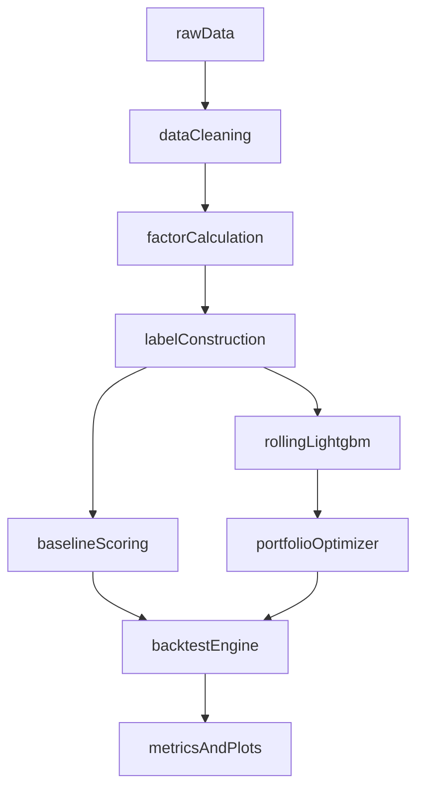

# 最小可行研究原型

## 目标

本阶段不追求完整系统，而是先构建一个可复现、可回测、可对照的研究闭环。
闭环跑通后，再逐步叠加模型和外部数据。

## MVP 定义

MVP 需要满足以下最小能力：

1. 能获取并整理沪深300成分股数据
2. 能计算核心因子并构造下一期标签
3. 能在月度频率下完成选股与调仓
4. 能输出组合收益、超额收益与风险指标
5. 能与沪深300基准做统一对照

## 输入定义

### 市场数据

- 个股日线开高低收成交量
- 复权因子
- 沪深300指数日收益率
- 成分股调整信息

### 基本面数据

- 市盈率或其倒数
- 市净率或其倒数
- ROE
- 毛利率

### 外部数据

- 北向资金净流入
- M2 同比增速

## 输出定义

MVP 至少输出以下结果：

- 调仓日持仓表
- 组合净值曲线
- 相对基准超额净值曲线
- 绩效指标表
- 因子暴露或特征重要性结果

## 固定参数

- 调仓频率：每月最后一个交易日
- 预测区间：下一月收益
- 样本划分：滚动训练、滚动测试
- 股票池过滤：剔除停牌、ST、极端缺失样本
- 标准化：按截面进行去极值与标准化

## MVP 流程

## 建议目录职责

### `data/`

- 原始行情
- 清洗后面板数据
- 因子结果缓存

### `src/`

- `src/data/`：数据读取、清洗、对齐
- `src/factors/`：因子计算
- `src/models/`：机器学习训练与预测
- `src/portfolio/`：组合优化与权重生成
- `src/backtest/`：回测与绩效计算

### `reports/`

- 图表
- 阶段性指标表
- 论文可复用结果

## 第一版推荐参数

为尽快得到第一版可运行结果，建议先固定以下参数：

- 因子数：6 到 8 个
- 选股数：30 到 50 只
- 持仓权重：基准权重加偏离或优化权重
- 训练窗口：24 到 36 个月
- 测试方式：月度滚动外推

## 完成标准

当以下条件全部满足时，可认为 MVP 完成：

- 能稳定生成调仓权重
- 能输出回测净值与超额收益曲线
- 能输出至少 1 个多因子基线结果
- 能输出至少 1 个 LightGBM 增强结果
- 能输出统一评价指标表
