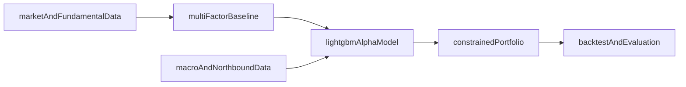

# 研究范围收敛

## 目标

在沪深300指数增强场景下，构建一套适合个人研究者、可在普通 PC 上复现的量化研究方案。该方案需要覆盖：

- 多因子增强
- AI 辅助决策
- 外部数据引入
- 组合风险约束
- 回测验证

## 最终采用的主路线

## 固定边界

### 研究对象

- 股票池：按调仓日可得的沪深300成分股
- 研究频率：日频计算，月度调仓
- 基准：沪深300指数收益率
- 持仓目标：在保持指数风格相近的前提下获取稳定超额收益

### 明确不做

- 不做高频交易
- 不做分钟级预测
- 不做复杂深度学习模型
- 不做大规模舆情爬虫和长文本 NLP 主线
- 不把 Web 系统开发作为主要交付物

## 因子层收敛结果

为控制复杂度，MVP 阶段先固定四类因子，每类选择 1 到 2 个代表指标。

### 价值因子

- `ep_ttm`：市盈率倒数
- `bp`：市净率倒数

### 质量因子

- `roe`
- `grossprofitmargin`

### 动量因子

- `ret_20`
- `ret_60`

### 低波动与交易活跃度因子

- `volatility_20`
- `turnover_20`

## 机器学习主线

模型只保留一条主线，避免范围发散：

- 主模型：`LightGBM`
- 任务形式：预测下一期个股相对基准的超额收益
- 标签定义：下一个调仓周期个股收益减去同期沪深300收益
- 训练方式：滚动训练与滚动预测

不将 `XGBoost`、`SVM`、深度学习并行作为主模型，只可作为补充对照。

## 外部数据收敛结果

为满足题目中“引入外部数据”的要求，同时控制数据处理复杂度，先固定两类结构化变量：

- `northboundNetInflow`：北向资金净流入，反映跨市场资金偏好
- `m2Yoy`：M2 同比增速，反映流动性环境

使用原则：

- 北向资金按交易日对齐
- M2 按月公布，向后对齐并前向填充到调仓日
- 外部数据只作为状态变量和补充特征，不单独决定持仓

## 组合构建收敛结果

组合构建以“指数增强”而非“纯选股”为目标，因此必须加入约束：

- 年化跟踪误差不高于 `8%`
- 单个行业相对基准偏离不超过 `2%`
- 单只个股权重不超过 `5%`
- 月度单边换手率尽量控制在 `20%` 以内

## 评价指标

最终统一采用以下指标比较各实验：

- 年化收益率
- 年化超额收益
- 年化波动率
- 夏普比率
- 信息比率
- 最大回撤
- 跟踪误差
- 月度胜率
- 年化换手率

## 论文结构映射

上述主线可直接映射到论文主体章节：

1. 多因子指数增强基线构建
2. 基于 LightGBM 的因子权重或收益预测增强
3. 带风险约束的组合优化设计
4. 外部数据对策略稳健性的提升分析

## 创新点扩展（2026-05 终版）

MVP 收敛之外，本研究最终扩展了四项以计算机算法/AI 为核心的创新点（详见论文 §1.3 与 §4）：

- **C1 LLM 舆情情感因子**：基于 Claude Opus 4.7 / Haiku 4.5 双通道，通过结构化 prompt、SHA-256 缓存与硬性预算守门，将大语言模型从昂贵的离线服务转化为可控成本的日频 alpha 来源；实测 610 条新闻打分成本 0.31 USD。
- **C2 异构 Stacking 集成**：LightGBM + XGBoost + 轻量 GRU + Ridge 异构 L1 模型族通过 OOF KFold 与 MLP 元学习器自适应融合；带优化器情境下 IR 5.92 击败单 LightGBM IR 5.84。
- **C3 Conformal Prediction**：Split / Mondrian CP + 三种置信加权 QP 方案；揭示 A 股低信噪比下"高置信即过拟合"的反向规律，覆盖率偏差恒定 -9pp。
- **C4 Numba JIT + joblib 并行**：回测核心循环 Numba JIT 编译，Kernel 级加速 130-310×、Engine 级加速 9.84×。

scope.md 中原"不做"清单的"不做大规模舆情爬虫和长文本 NLP 主线"在 C1 中被部分突破：本文最终引入了基于 LLM API 的离线短文本情感打分（非自爬虫 NLP），通过 SHA-256 缓存与预算守门将其工程化为低成本的可控管线，与原"不做"清单的核心精神（不投入大量算力做自训 NLP 主线）一致。

## 现状映射到论文章节

| MVP 阶段研究范围 | 最终论文章节 |
|---|---|
| 多因子基线构建 | §3 因子设计 + §5.2 长周期基线 |
| LightGBM 增强 | §4.1 + §5.3 约束消融 |
| 组合优化 | §4.6 二次规划 + §5.3-5.4 增益 |
| 外部数据增益 | §3.3 宏观因子 + §5.4 增益对照 |
| 回测验证 | §5 整章 11 个子节 |
| **C1 LLM 舆情** | §4.2 + §5.5 + §3.19 (exp log) |
| **C2 Stacking** | §4.3 + §5.6 + §5.9 |
| **C3 Conformal** | §4.4 + §5.7 (6 子节) |
| **C4 Numba** | §4.5 + §5.8 (双层加速) |

