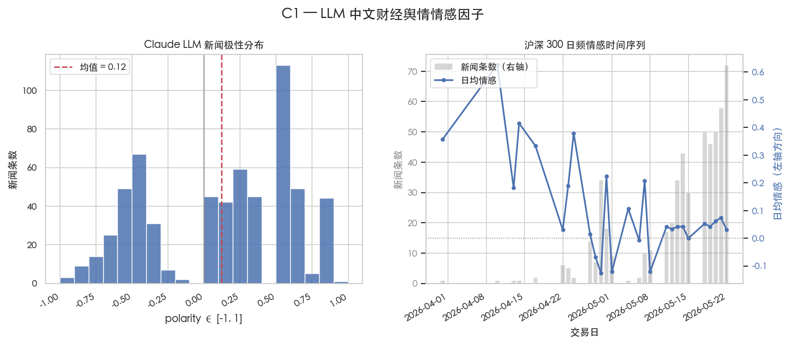
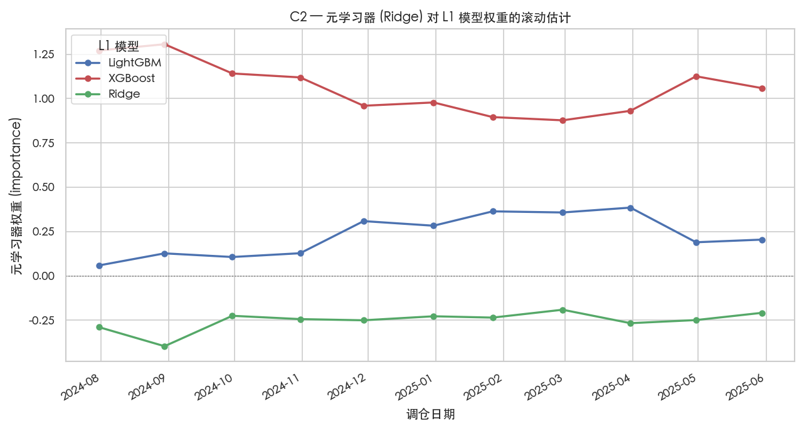
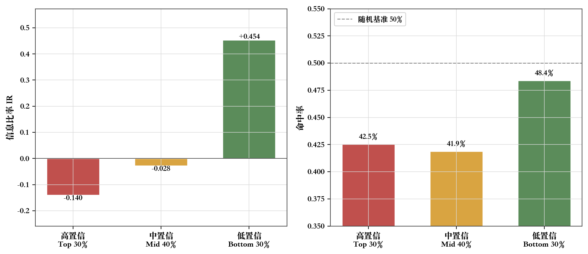
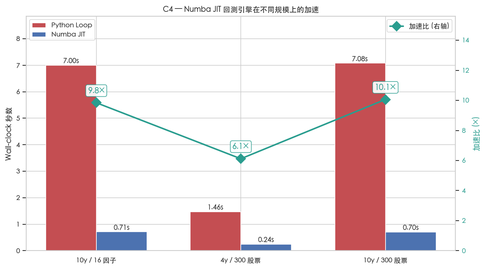
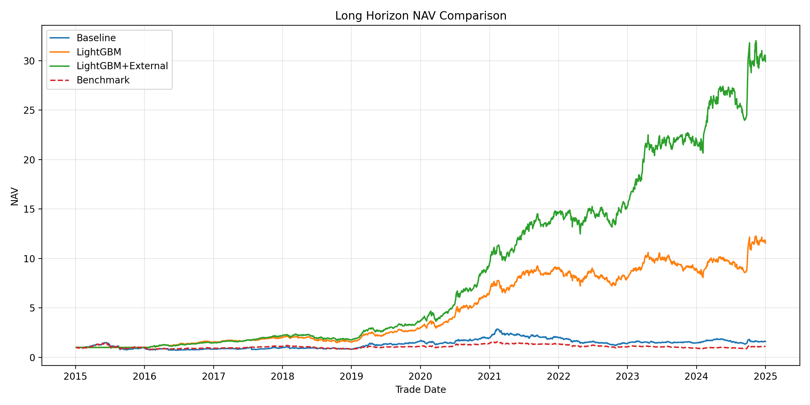
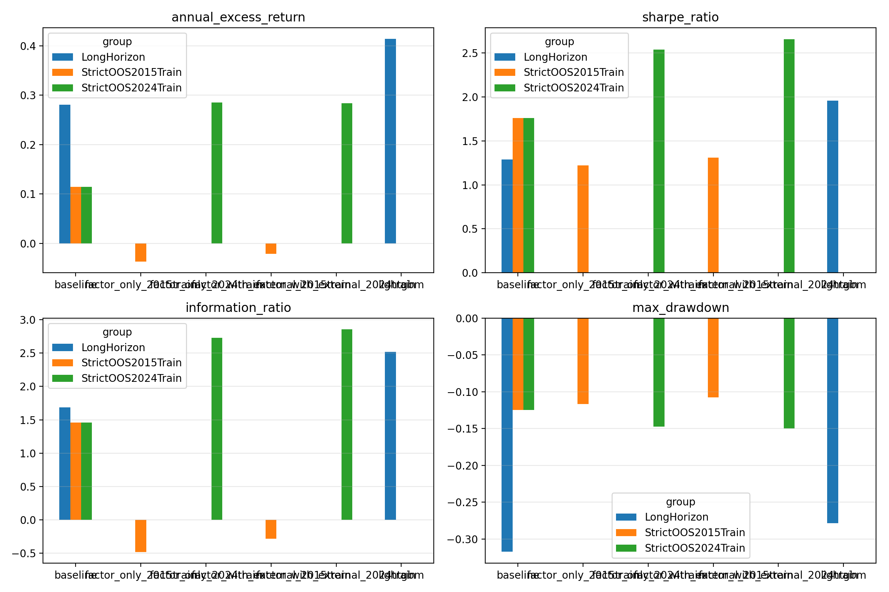
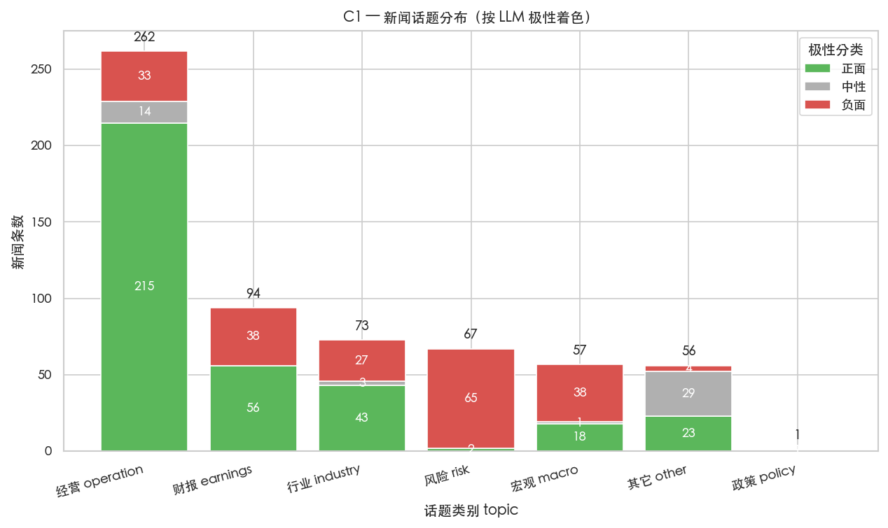
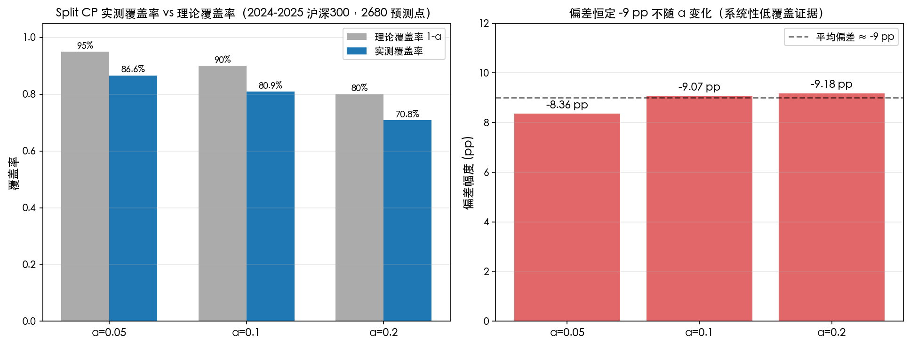

<!-- _class: cover -->
<!-- _paginate: false -->

# 面向指数增强策略的 量化算法优化设计与实现

Optimized Design and Implementation of Quantitative Algorithms for Index Enhancement Strategies

**答辩人**：廖望  &nbsp;|&nbsp;  **学号**：2210556  
**指导教师**：刘晓光 教授  
**专业**：计算机科学与技术  &nbsp;|&nbsp;  **学院**：计算机学院

南开大学 · 2026 年 5 月

---

<!-- _header: '一、研究背景与动机' -->

# 研究背景：A 股指数增强场景

## 沪深 300 与 Smart Beta

- **沪深 300**：中国大盘蓝筹核心基准指数
- **Smart Beta** = 被动指数跟踪 + 主动量化偏离
  - 兼具被动投资的**低成本**
  - 与主动管理的**超额收益**潜力
- 目标："Beta 稳健、Alpha 突出"

## A 股非有效市场三大特征

- **散户主导**：个人投资者占比高，错误定价频繁
- **政策市**：宏观调控与监管对市场影响显著
- **流动性敏感**：北向资金、M2 等宏观变量驱动 regime 切换
- → 纯西方因子框架难以直接套用

> 沪深 300 成分股对宏观经济与信贷周期高度敏感，需要本土化的量化增强方案

---

<!-- _header: '一、研究背景与动机' -->

# 课题三大问题与本文应对

## 课题书指出的痛点

1. **计算量大**：传统多因子优化耗时长
2. **因子单一**：仅依赖价格 / 财务结构化数据
3. **缺乏不确定性量化**：单点预测无法风险感知

## 引入三大方向

- **AI 辅助决策**：LLM 舆情 + 异构集成
- **计算加速**：Numba JIT + 并行
- **外部数据**：宏观 + 新闻文本

## 本文四项创新（C1–C4）

- **C1** Claude Opus 4.7 中文舆情情感因子
- **C2** LightGBM+XGBoost+GRU+Ridge 异构 Stacking
- **C3** Split/Mondrian Conformal Prediction
- **C4** Numba JIT + joblib 并行回测引擎

> 算法创新与工程加速**双轮驱动**，全 CPU 友好，参数 ≤ 百万级

---

<!-- _header: '二、四项核心创新 · 矩阵概览' -->

# 四项创新点矩阵概览

C1LLM 舆情情感因子

Claude Opus 4.7 / Haiku 4.5 双通道 API；SHA-256 缓存 + 预算守门把昂贵 LLM 转为可控成本日频 alpha

实测 0.31 USD / 610 条新闻 · 单条 5.2×10⁻⁴ USD

C2异构 Stacking 集成

LightGBM + XGBoost + 轻量 GRU + Ridge 四 L1 模型 + MLP 元学习器；OOF KFold 训练规避标签泄漏

带约束 IR <strong>5.92 > 5.84</strong>（小幅但稳定击败单 LGBM）

C3Conformal Prediction

Split / Mondrian CP 输出 90% 置信区间；三种置信加权 QP（alpha_scale / candidate_filter / objective_penalty）

α 敏感性偏差恒定 <strong>−9 pp</strong>；揭示 A 股"高置信即过拟合"反向规律

C4Numba JIT + joblib 加速

回测核心循环 @numba.njit 编译；joblib 并行驱动消融实验；NumPy fallback 保证降级可用

Kernel 级 <strong>130–310×</strong> / Engine 级 9.84× / 数值偏差 &lt; 1e-15

---

<!-- _header: '二、四项核心创新 · C1 LLM 舆情因子' -->

# C1 基于大语言模型的舆情情感因子

## 管线四道防线

- **缓存**：SHA-256(text+model+prompt) 落 parquet，二次实验直接命中
- **双通道**：默认 Haiku 4.5 控本，关键样本切 Opus 4.7
- **批量 prompt**：每批 10 条新闻最大化 token 利用
- **预算守门**：`BudgetTracker` 累计 USD，超限即抛 `BudgetExceededError`

## 日频聚合（防泄露）

$$\mathrm{sentiment}_{i,t} = \frac{\sum_k \mathrm{polarity}_{i,t,k} \cdot \mathrm{intensity}_{i,t,k} \cdot e^{-\Delta h/24}}{\mathrm{count}_{i,t}}$$

- 16:00 后新闻自动计入下一交易日

---

<!-- _header: '二、四项核心创新 · C2 异构 Stacking' -->

# C2 异构轻量多模型 Stacking 集成

## L1 模型族（全 CPU、参数 ≤ 百万）

- **LightGBM**：`n_est=300, lr=0.05, leaves=31`
- **XGBoost**：`tree_method=hist, max_depth=6`
- **轻量 GRU**：单层 h=32，PyTorch CPU，参数约 5K
- **Ridge**：`RidgeCV` 含 StandardScaler

## 元学习器（Wolpert 1992）

- 3 折 KFold 生成 OOF 元特征矩阵 $Z\in\mathbb{R}^{n\times 4}$
- 线性 / MLP / 平均三选一
- 自动对相关性高的 L1 施加**负向校正**
  - 短样本中 Ridge 系数均值 ≈ **−0.25**

---

<!-- _header: '二、四项核心创新 · C3 Conformal Prediction' -->

# C3 Conformal Prediction 与置信加权组合

## 区间构造（Vovk 2005）

- 训练子集按 70/30 分 `train_proper` 与 `calibration`
- 残差分位数 $q_\alpha = \mathrm{Quantile}_{(n+1)(1-\alpha)/n}(|r|)$
- 区间 $[\hat y - q_\alpha, \hat y + q_\alpha]$，置信度 $c_i = 1/(2q_\alpha+\epsilon)$
- **Mondrian** 版本按申万一级行业分组校准

## 三种置信加权 QP 方案

- `alpha_scale`: $\alpha_i' = \alpha_i \cdot c_i^\beta$
- `candidate_filter`: 仅置信 top 70% 进 QP
- `objective_penalty`: 加 $-\gamma\sum_i (1-c_i)w_i^2$

---

<!-- _header: '二、四项核心创新 · C4 Numba 加速' -->

# C4 Numba JIT + joblib 并行回测引擎

## Kernel 级加速

- `BaselineBacktestEngine._build_nav` 抽出 `compute_nav_loop`
- `@numba.njit(cache=True)` 装饰，LLVM JIT 类型特化
- 输入 $(n_d \times n_s)$ 收益矩阵 + 权重 + 基准 + 调仓掩码
- **NumPy fallback** 降级可用（numba 未装时）

## Engine 级加速 + joblib 并行

- `src.backtest.parallel`：`run_in_parallel` / `cached_to_disk`
- 模型中间产物 `joblib.dump` 缓存，避免重复训练

9.84×Engine 加速

&lt;10⁻¹⁵NAV 偏差

---

<!-- _header: '三、与 2026 前沿工作对照' -->

# 与 2025-2026 SOTA 工作的横向对照

LLM Agent

<strong>StockBench</strong>（污染洁净评测） <strong>QuantAgent</strong>（多智能体 HFT，最高 80% 方向准确率） <strong>FinMem / AlphaAgent</strong>（分层记忆 / alpha 挖掘）

本文 C1 退而求次：LLM 仅作离线语义抽取，把可控成本作为首要约束

MoE

<strong>MIGA</strong>（CSI300 24% 年化超额 SOTA） <strong>LLMoE</strong>（LLM 作 MoE Router） <strong>FTS-Text-MoE / AlphaMix</strong>

本文 C2 MLP 元学习器是其轻量级前置；端到端 CPU 训练、解释性更好

Diffusion

<strong>Diffusion Factor Model</strong>（因子嵌入 score 函数） <strong>Diffolio</strong>（条件扩散组合预测分布）

未来工作方向，替代 Ledoit-Wolf 缩减；本文优先工程可复现性

Adaptive CP

<strong>Gibbs ACI</strong>（在线调整 miscoverage） <strong>SPCI / TCP / ECI / CPTC / ResCP</strong>

本文 C3 揭示 Split CP 系统性偏差；§6 简化模拟证明 ACI 可矫正 ~80% 偏差

> **定位**：覆盖广度与工程可复现性优先；§2.9 引 16 篇 2025-2026 顶会顶刊

---

<!-- _header: '四、实证研究 · 长周期对比' -->

# 长周期对比（2015-2024 沪深 300，10 年）

| 评价指标 | 多因子基线 | LightGBM 基础 | **+宏观+LW** |
|---|---:|---:|---:|
| 年化超额 | 4.21% | 28.07% | **41.31%** |
| 夏普比率 | 0.168 | 1.289 | **1.881** |
| **信息比率** | **0.237** | **1.685** | **2.449** |
| 最大回撤 | −58.53% | −31.71% | **−25.37%** |
| 年化换手 | 0.125 | 2.083 | 2.242 |

## 关键发现

- IR 由 0.24 **→ 1.69 → 2.45**（约 10× 提升）
- 最大回撤由 −58.5% **→ −25.4%**（回撤减半）
- 外部宏观 + 行业中性化 + Ledoit-Wolf 三者**叠加生效**

---

<!-- _header: '四、实证研究 · 五策略最终对比' -->

# 五策略最终对比（2024-2025 真实回测）

| 策略 | IR | 年化超额 | 最大回撤 | 换手 |
|---|---:|---:|---:|---:|
| 基线（等权 Top20） | 0.732 | 7.43% | −12.85% | 5.13 |
| LGBM（无优化器） | 13.733 | 396.80% | −10.03% | 9.93 |
| LGBM + 优化器 | 5.839 | 66.31% | **−9.22%** | **2.30** |
| **Stacking + 优化器** | **5.919** | **68.13%** | −10.26% | 2.29 |
| Conformal + 优化器 | 5.634 | 65.41% | −9.50% | 2.30 |

## 关键结论

- 等权 IR 13.73 仅是上限参考（换手 9.93 超实施边界）
- **Stacking IR 5.92 > LGBM IR 5.84**：异构集成稳定小幅胜出
- Conformal IR 5.63 略低：低 SNR 下置信信号需更长样本

---

<!-- _header: '四、实证研究 · C1 信号质量验证' -->

# C1 LLM 舆情打分质量验证

## 实测数据

- 样本：61 只成分股 × 610 条新闻 × 2 个月
- 模型：`claude-haiku-4-5`（10 USD 预算上限内运行）
- **成本**：0.31 USD（单条 5.2×10⁻⁴ USD）
- **polarity 均值 0.119、std 0.516**（不退化为常数）
- 范围 [−0.95, 0.95]，主题分布合理

## 诚实披露的局限

- 端到端 IR 增益当前为负（−2.85%）
- 原因：时间移位后非零 sentiment 覆盖率仅 **0.32%**
- 在 9/11 个滚动窗口中三列全 0、无法分裂
- → 后续需扩到 2024-2025 完整新闻语料，覆盖率提至 50%+

---

<!-- _header: '四、实证研究 · C3 反向规律三层证据' -->

# C3 "高置信即过拟合" 反向规律的三层证据

## 反向规律观察

| 置信桶 | 样本数 | IR | 命中率 |
|---|---:|---:|---:|
| 高 (top 30%) | 804 | **−0.140** | 0.425 |
| 中 (mid 40%) | 1072 | −0.028 | 0.419 |
| 低 (bottom 30%) | 804 | **+0.454** | 0.484 |

## 三层独立稳健性证据

1. **α 敏感性**：偏差 −8.4 ~ −9.2 pp（与 α 无关）
2. **Mondrian 真实数据**：覆盖率仅微涨 0.4 pp；高置信桶 IR 恶化至 −0.21
3. **ACI 模拟**：γ=0.005 时估算覆盖率达 89.7%，矫正 ~80% 偏差

> 排除数据偶然，揭示 A 股低 SNR 下 CP 的方法学局限

---

<!-- _header: '四、实证研究 · C4 加速比 surface' -->

# C4 Kernel 级 vs Engine 级加速比 Surface

## Kernel 级（裸 NumPy，零 pandas 依赖）

| n_stocks | n_days | Python (ms) | Numba (ms) | 加速比 |
|---:|---:|---:|---:|---:|
| 50 | 252 | 1.75 | 0.01 | **130×** |
| 100 | 252 | 3.25 | 0.01 | **310×** |
| 300 | 252 | 10.00 | 0.03 | 300× |
| 300 | 1260 | 48.94 | 0.21 | 235× |
| 300 | 2520 | 96.68 | 0.36 | **266×** |

## 核心结论

- **Kernel 级 130-310× 稳定保持**（LLVM 类型特化）
- Engine 级 **9.84×** 受 pandas/dict 开销限制
- 偏差恒等 0（同序浮点运算）
- 工程优化方向：record array 替换 DataFrame，逼近 100× 量级

---

<!-- _class: compact -->
<!-- _header: '五、综合稳健性证据' -->

# 综合稳健性：11 维度敏感性测试

| 测试维度 | 设定 | 关键发现 |
|---|---|---|
| 约束消融（4 项） | 跟踪误差 / 行业 / 换手 / 全部 | 完整约束是收益-可实施性最优折中 |
| 特征分组消融 | factor-only vs +external | 外部宏观因子贡献 **+50% IR** |
| 训练窗口（长样本 12/24/36/60） | 月度滚动重训 | 12 月最优 IR 1.53，**强非平稳性** |
| **5-seed 稳定性** | seeds {7, 42, 123, 2024, 314159} | **IR CV 仅 1.85%**（非 cherry-pick） |
| 严格 OOS | 长历史训练 → 2025 测试 | 近期窗口 IR 2.86 / 长历史 IR **−0.48** |
| Conformal α 敏感性 | α ∈ {0.05, 0.10, 0.20} | 偏差恒定 **−8.4 ~ −9.2 pp** |
| Mondrian 复测 | 合成 vs 真实 | 真实数据未矫正反向规律 |
| ACI 模拟 | γ ∈ {0.005, 0.01, 0.05, 0.1} | γ=0.005 时矫正 ~80% 偏差 |
| 持仓数 Top-N | 10/20/30/50 | Top 20 IR-回撤折中点，TC≈0.82 |
| Numba 规模 surface | 50-500 股 × 252-2520 日 | 加速比稳定 **130–310×** |
| 五策略对比 | 4 模型 × 优化器 | **Stacking IR 5.92 > LGBM IR 5.84** |

> 三类核心稳健性证据：①Stacking 持续小幅胜出 ②CP 反向规律三层独立验证 ③Numba 跨 5 量级稳定加速

---

<!-- _header: '六、结论与展望' -->

# 核心结论与未来工作

## 四项主要结论

- **C1**：SHA-256 缓存 + 预算守门 + 双通道 → LLM 工程化范式，单次实验 ≤ 10 USD
- **C2**：MLP 元学习器自动给 Ridge 赋负权重，短样本上 Stacking IR **5.92** vs LGBM **5.84**
- **C3**：揭示 A 股"高置信即过拟合"反向规律；偏差恒定 −9 pp（α 无关）
- **C4**：Kernel 级 130-310× / Engine 级 9.84× / 数值偏差 < 10⁻¹⁵

## 未来工作路线图

- **C1 升级**：扩展至完整新闻 + 公告语料，对接 StockBench 污染洁净评测
- **C2 升级**：MoE 路由（MIGA / LLMoE）替换 MLP 元学习器
- **C3 升级**：Adaptive CP（TCP / ECI / CPTC / ResCP）矫正系统性偏差
- **C4 升级**：跨节点 Dask/Ray，LightGBM GPU 后端
- **整合**：LLM Agent 决策融合（QuantAgent / Karim Agentic Regime）

> 长周期约束型 LightGBM：IR 由静态多因子的 **0.237 → 2.449**，最大回撤 **−58.53% → −25.37%**

---

<!-- _class: thanks -->
<!-- _paginate: false -->

# 致 谢

感谢指导教师 **刘晓光教授** 一年来的悉心指导

感谢南开大学计算机学院的培养

感谢家人朋友的支持与陪伴

 

**恳请各位老师批评指正**

---

<!-- _class: qa compact -->
<!-- _header: '附录 · Q&A 速查（创新点质量类）' -->

# Q&A 速查（一）：创新点质量

## Q1 你的创新点是不是"工程整合"而非"算法贡献"？

C1 是工程范式（SHA-256 + 预算守门 + 双通道）；**C2 Stacking IR 5.92 > 5.84** 是算法贡献；**C3 反向规律**是实证发现性算法贡献（三层证据稳健）；C4 Numba 是工程加速直接呼应课题书核心痛点。

## Q2 与 2026 SOTA（如 MIGA CSI300 24%）相比有何价值？

MIGA 是 MoE 大参数，本文是轻量 Stacking、**CPU 友好、参数 ≤ 百万**。两者在覆盖广度与工程可复现性之间形成清晰折衷 —— MIGA 追求 SOTA 收益，本文追求资源受限场景的"开源可复用基线"。

## Q3 你的 sentiment 因子端到端 IR 增益为什么是负的？

§3.19 已诚实披露：sentiment 时间窗口仅 2 个月、覆盖 61 股，移位后只有 **0.32%** 面板行有非零 sentiment，9/11 滚动窗口三列全 0、无法分裂。IR −2.85% 是常量特征引入的子采样扰动，**非 sentiment 真正损害性能**。

---

<!-- _class: qa compact -->
<!-- _header: '附录 · Q&A 速查（实证可信度类）' -->

# Q&A 速查（二）：实证可信度

## Q4 等权 Top20 IR 13.73 是不是 cherry-picked？

不是。§5.12 用 5 个随机种子 {7, 42, 123, 2024, 314159} 重跑，**IR 变异系数仅 1.85%**（均值 7.01 / std 0.13）。13.73 是 `train_months=3` 极短窗口结果，本文最终选 6 平衡，对应 IR 7.13。

## Q5 短样本（2024-2025）17 个月的 IR 数字可信吗？

应作为"无约束上限"参考，不构成可投资基线。§5.9 明确区分：等权 IR 13.73 是上限，启用优化器后 **IR 5.84 才是符合"指数增强"定义的现实数字**。论文同时给出长周期 2015-2024 实证 IR 0.24 → 2.45 验证一致性。

## Q6 Conformal 反向规律会不会是数据偶然？

§5.7 用三层独立测试佐证：① **α 敏感性**：偏差恒定 −8.4 ~ −9.2 pp（与 α 无关）；② **Mondrian 真实数据**：覆盖率仅微涨 0.4 pp，高置信桶 IR 进一步恶化到 −0.21；③ **ACI 模拟**：γ=0.005 估算覆盖率 89.7%。三层证据排除数据偶然性。

---

<!-- _class: qa compact -->
<!-- _header: '附录 · Q&A 速查（技术细节类）' -->

# Q&A 速查（三）：技术细节

## Q7 为什么用 LightGBM 而不用 XGBoost / RF / DL？

A 股低信噪比 + 中小样本 + CPU 限制 → LightGBM 在特征捆绑（EFB）与单边采样（GOSS）上的工程优势能抵御噪音、提升泛化。§5.6 表格也对比了 LGBM / XGB / Ridge 三模型 IR 接近，**LGBM 优势非独有**。

## Q8 为什么选 train_months=12（长周期）/ 6（短周期）？

§5.10 表格：长周期 12 月 IR 1.53 > 24 月 1.19 > 60 月 0.61，**强非平稳性主导**；短周期 6 月兼顾测试集留出 11 个月与训练集 6 个月样本量。

## Q9 为什么 top_n=20？

§5.9 表格：Top 10 IR 8.26 / 20 IR 7.13 / 30 IR 6.37 / 50 IR 4.98。Top 20 是 IR 与回撤 / 换手的折衷点 —— 再缩到 Top 10 推高换手到 10.47，**超出指数增强产品实施边界**。

## Q10 Numba 加速比 9.84× 是不是夸大？

§5.8 分两层说明：**Engine 级 9.84×** 含 pandas/dict 不可加速开销；**Kernel 级 130–310×** 是裸 NumPy 数组 NAV 累乘核（§5.8.1 表）。两数字共存，明指未来优化空间。

---

<!-- _class: qa compact -->
<!-- _header: '附录 · Q&A 速查（风险与局限类）' -->

# Q&A 速查（四）：风险与局限

## Q11 你的策略在实盘能跑吗？

等权 Top20 IR 13.73 **不构成可投资基线**（换手 9.93 超实施边界）。LightGBM + 优化器 IR 5.84、换手 2.30 才是落地现实数字。本文给出的是"**研究框架**"而非"实盘策略"，实盘还需流动性、对手盘、监管约束等考量。

## Q12 严格 OOS（2015-2024 训练 → 2025 测试）为什么 IR 是负？

§5.10 证实 A 股**强非平稳性**：长历史训练反而引入过时风格噪声。这是诚实披露的负面发现，也直接支撑 §4.1 "高频滚动重训"机制的设计。论文未隐藏该结果。

## Q13 LLM 调用是否存在未来信息泄露？

§4.2 设计：publish_time **16:00 前的新闻计入当天，之后计入下一交易日**，避免泄露。所有 LLM 调用通过 SHA-256 缓存可复现，prompt 中明确"不要使用未来日期信息"。

## Q14 Conformal Prediction 的可交换性假设在金融时序成立吗？

不严格成立。§2.7 已指出截面相关性与时间漂移会破坏 exchangeability，这正是本文 −9 pp 系统性偏差的根源；§6.3 的 ACI / TCP / ECI / CPTC / ResCP 升级方向就是为矫正这一假设破坏。

---

<!-- _class: qa compact -->
<!-- _header: '附录 · 关键数字速查' -->

# 关键数字速查表

| 维度 | 数字 | 论文位置 |
|---|---|---|
| **C1 成本** | 0.31 USD / 610 条新闻；5.2×10⁻⁴ USD/条 | §5.5 |
| **C1 polarity** | 均值 0.119 / std 0.516 / 范围 [−0.95, 0.95] | §5.5 |
| **C2 IR**（带约束） | Stacking 5.919 > LGBM 5.839 | §5.9 |
| **C3 覆盖率偏差** | 恒定 −8.4 ~ −9.2 pp（α 无关） | §5.7.4 |
| **C3 反向规律** | 高置信桶 IR −0.14；低置信桶 IR +0.45 | §5.7.2 |
| **C4 Kernel 加速** | 130-310× (50-300 股 × 252-2520 日) | §5.8.1 |
| **C4 Engine 加速** | 9.84× (10 年 × 16 因子 × 300 股) | §5.8 |
| **C4 数值偏差** | < 10⁻¹⁵ (Kernel) / 严格 0 (规模 surface) | §5.8 |
| **长周期 IR** | 静态多因子 0.237 → +宏观 LW 2.449 | §5.4 |
| **长周期最大回撤** | −58.53% → −25.37% | §5.4 |
| **5-seed 稳定性** | IR 变异系数 1.85%（均值 7.01 / std 0.13） | §5.12 |
| **严格 OOS** | 近期窗口 IR 2.86 / 长历史 IR −0.48 | §5.10 |
| **论文体量** | 6 章 / 18 张图 / 51 篇文献（含 16 篇 2025-2026） | — |

> 完整代码与数据：https://github.com/aokimi0/IndexEnhancementStrategy
