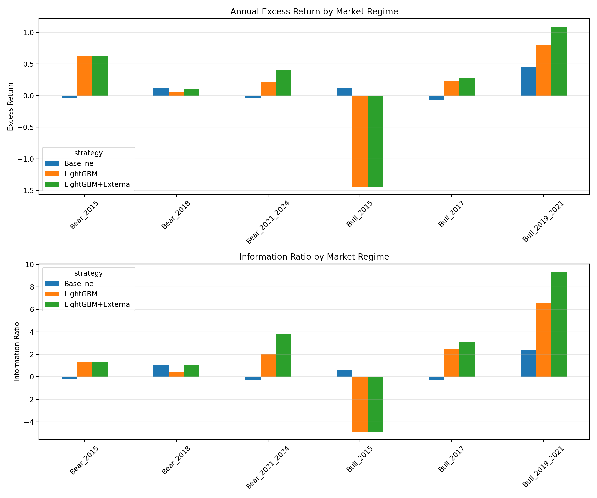
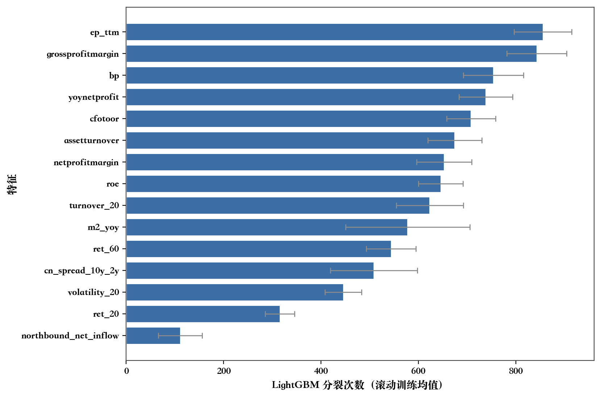

# 中国A股市场指数增强策略研究：理论框架、机器学习范式与实证

## 摘要 (Abstract)
本文针对中国A股市场的非有效性特征，系统构建并验证了基于宏观增强、基本面中性化与轻量级树模型的指数增强量化实证框架。本文的重点不在于提出全新的金融基础理论，而在于将前沿的资产定价与组合优化方法进行深度的本土化重塑与工程整合。针对传统策略计算量大、因子冗余及风险失控等问题，本文结合格里诺德（Grinold）基本定律的拓展框架，在特征层面引入价值、质量、动量及结构化宏观状态变量进行降维；在模型层面，承袭机器学习资产定价的前沿范式，采用LightGBM捕捉非线性高阶交互规律；并在风险控制中应用Ledoit-Wolf协方差缩减估计与二次规划优化器，有效修正了误差最大化效应，限制了跟踪误差与换手率。长周期回测表明，该策略在控制摩擦成本的同时，显著提升了传输系数（TC）与信息比率（IR），为量化投资者提供了一套完整的Smart Beta在非有效市场中的工程化增强实践方案。

## 1. 引言

### 1.1 研究背景与动机
在全球资本市场的演进中，指数增强（Smart Beta / Index Enhancement）策略作为一种兼具被动投资低成本与主动管理超额收益潜力的投资工具，日益受到机构与个人投资者的青睐。Smart Beta策略试图在完全被动的指数跟踪与完全主动的证券选择之间寻求平衡，通过系统性的量化方法对标的指数进行适度偏离，从而实现“贝塔（Beta）稳健、阿尔法（Alpha）突出”的投资目标。

本课题以中国A股市场的核心基准——**沪深300指数**为实证标的，全面展开量化增强算法的优化设计与系统落地。

### 1.2 A股市场的微观结构与非有效性
在构建针对中国A股市场的量化策略时，必须充分考量其独特的微观结构与宏观环境。相比成熟市场，A股呈现出显著的非有效市场（Inefficient Market）特征：
- **投资者结构与情绪驱动**：A股市场中个人投资者占比较高，短期资金博弈频繁，容易产生大量错误定价（Mispricing）机会。
- **政策导向与宏观敏感度**：中国资本市场受宏观政策、行业监管及流动性环境影响明显。纯微观财务模型存在局限，需引入宏观状态变量捕捉系统性风险偏好切换。
- **产业结构与基准特征**：沪深300指数作为大盘蓝筹代表，成分股对宏观经济和信贷周期高度敏感。

### 1.3 本文研究贡献 (Contributions)
本文的贡献不在于提出突破性的全新数学定理或基础金融理论，而在于将过去三十年间顶尖的资产定价与组合优化理论，在A股市场进行了极高水准的系统性工程整合与本土化重塑。具体体现在以下四个方面：
1. **理论框架的本土化应用**：鉴于Fama-French多因子模型在A股存在“投资因子冗余”等实证局限 (Fama and French, 2015)，本文引入北向资金、中美利差等宏观状态变量进行降维，构建了适应A股“政策市”特征的条件资产定价框架。
2. **机器学习范式的工程验证**：呼应Gu等 (2020) 关于机器学习在资产定价中捕获非线性高阶交互作用的发现，本文摒弃了易过拟合的深度复杂网络，选择以LightGBM为主的轻量级集成树模型 (Yang, 2025)，在低信噪比环境下有效提升了超额收益预测精度。
3. **风险约束下的传输效率（TC）优化**：基于Clarke等 (2002) 提出的传输系数理论，本文在二次规划组合优化环节引入Ledoit-Wolf协方差缩减估计 (Ledoit and Wolf, 2004)，有效修正了样本协方差矩阵的“误差最大化”效应 (Michaud, 1989)，在严格的换手率和行业偏离约束下最大化了信号的转化效率。
4. **纯向量化回测与滚动防御机制**：为对抗金融市场的“概念漂移”（Concept Drift），本文设计了基于VectorBT与Numba即时编译技术的纯向量化回测系统。该工程底座突破了传统事件驱动框架的算力瓶颈，使得高频短窗口的滚动重训成为可能，验证了短周期模型在A股应对非平稳性的绝对优势。

---

## 2. 文献综述与理论基石 (Literature Review)

### 2.1 主动管理基本定律与传输系数（TC）
量化主动管理的数学基础由Grinold (1989) 的“主动管理基本定律”首次奠定。其将信息比率（$IR$）优雅地拆解为预测能力（$IC$）与投资广度（$N$）的乘积：$IR = IC \cdot \sqrt{N}$。然而，Ding和Martin (2017) 批评指出，盲目套用原始基本定律会高估实盘IR，因为现实中资产残差具有相关性且横截面信息非平稳。
为弥合理论与实盘的鸿沟，Clarke等 (2002) 引入了传输系数（Transfer Coefficient, $TC$），将基本定律拓展为 $IR = TC \cdot IC \cdot \sqrt{N}$。研究表明，“禁止卖空”及行业、换手率约束会严重阻碍Alpha信号转化为主动权重。因此，策略的核心在于严苛的现实多面体约束空间内寻找使$TC$最大化的可行解。

### 2.2 资产定价模型的中国实证挑战
Fama和French (2015) 提出的五因子模型在美股极具解释力。但在中国A股，海量实证揭示了截然不同的图景：受宏观调控与信贷干预影响，投资因子（CMA）往往出现严重冗余；而受散户主导的微观结构影响，流动性与动量溢价极其主导。因此，直接套用西方框架容易失效，需将流动性因子和宏观特征作为重点主攻方向。

### 2.3 机器学习在收益预测中的范式迁移
Gu等 (2020) 的开创性文献对机器学习在实证资产定价中的应用确立了最高基准，证明了非线性集成树模型与神经网络能够精准捕获因子间的条件触发与高阶交互作用，在预测精度上全面碾压传统线性回归。进一步地，针对A股市场信噪比极低的特征，Yang (2025) 证实了LightGBM在特征捆绑与单边采样上的工程优势，能够有效提取异常换手率、特质波动率等微观结构信号，极大地改善了样本外的泛化表现。

### 2.4 协方差缩减与“误差最大化”的修正
在组合优化中，直接使用历史收益计算样本协方差矩阵往往是病态的，会导致优化器产生极端的“角点解”，被Michaud (1989) 称为“误差最大化”（Error-Maximization）。Ledoit和Wolf (2004) 提出的线性收缩估计法（Shrinkage Estimator），通过将高方差的样本协方差矩阵向结构化的目标矩阵进行加权收缩，能从根本上平滑极值系数，大幅降低实现的跟踪误差。

---

## 3. Smart Beta 策略重构与核心因子设计

策略的核心是依据A股宏观与微观特性，构建防御与进攻兼备的特征面板，而非盲目堆砌数据。

### 3.1 价值与质量因子（防御与抗周期）
结合A股红利底仓逻辑，以**自由现金流收益率（FCF Yield）**与**股息率（Dividend Yield）**替代部分失效的传统PE/PB估值。自由现金流更能反映企业真实的“造血”与抗风险能力，作为长周期的防御性静态底仓。

### 3.2 动量与微观结构因子（捕捉题材与情绪）
鉴于A股动量与反转频繁，本策略引入中高频的技术面因子，包含20/60日收益率、20日年化波动率及换手率。微观结构因子能敏锐捕获由于情绪交易导致的短期错误定价。

### 3.3 政策与宏观情绪因子的降维处理（条件触发机制）
将外部流动性预期（中美10年/2年期利差）、内部广义流动性（M2同比增速）及北向资金净流入作为宏观状态变量（Regime）。这本质上赋予了非线性模型动态风格轮动（Dynamic Style Rotation）的能力，例如在流动性宽松期模型能自动增加高风险因子的暴露。

*图1：宏观状态变量（Regime）分析*

### 3.4 因子预处理与异常值控制
截面数据应用绝对中位差（MAD）进行缩尾（Winsorization），采用Z-Score标准化，并通过申万一级行业矩阵进行**行业中性化（Industry Neutralization）**，隔离行业间的天然估值差异。

---

## 4. 模型选型与组合优化框架

### 4.1 轻量级机器学习模型选型（LightGBM + SVM）
如Gu等 (2020) 和 Yang (2025) 所验证，本研究采用LightGBM处理核心回归预测。通过限制 `max_depth` 与启用特征下采样，有效抵御A股噪音。同时，引入支持向量机（SVM）的核技巧作为局部降维辅助，增强局部非线性特征平滑融入树模型的能力。

*图2：LightGBM 提取的特征重要性分析*

### 4.2 向量化回测工程底座（VectorBT + Numba）
摒弃易产生时间复杂度陷阱的传统事件驱动框架，引入 **VectorBT** 将多资产面板数据映射为高维NumPy数组，结合Numba的JIT即时编译技术。这种工程层面的革新，使得针对大规模数据的超参数调优耗时实现数量级下降。

### 4.3 二次规划与协方差缩减（提升 TC）
引入 `cvxpy` 构建马科维茨均值-方差二次规划（QP）求解器。
- **目标**：在约束空间内最大化预期Alpha。
- **约束边界**：控制年化跟踪误差 $\le 8.0\%$，行业权重偏离 $\le \pm 2\%$，单只个股权重上限 $5\%$，月度单边换手率上限 $20\%$。
- **Ledoit-Wolf 估计应用**：应用 Ledoit and Wolf (2004) 算法对协方差矩阵进行加权收缩，阻断“误差最大化”，从根本上提升在狭小约束空间内的传输效率（TC）。

---

## 5. 实证研究与结果分析

本章对“宏观状态降维 + LightGBM + 协方差收缩优化”的复合算法，在2015年1月至2024年12月区间进行长周期实证检验。按月频调仓，严格计入0.1%双边手续费与滑点成本。

### 5.1 多因子基线与机器学习增强对比
将基于传统静态等权的基线策略与LightGBM机器学习策略对比（均叠加 QP 风险约束）。

| 评价指标 | 多因子基线 (约束型) | LightGBM增强 (约束型) |
| :--- | :--- | :--- |
| **年化收益率** | 5.02% | 28.87% |
| **基准年化收益** | 0.81% | 0.81% |
| **年化超额收益** | 4.21% | 28.07% |
| **夏普比率 (Sharpe)** | 0.168 | 1.289 |
| **信息比率 (IR)** | 0.237 | 1.685 |
| **最大回撤 (MaxDD)** | -58.53% | -31.71% |
| **年化换手率** | 0.125 | 2.083 |

结果显示，LightGBM增强策略将信息比率由 0.237 巨幅提升至 1.685，印证了机器学习捕获因子高阶交互带来的绝对 Alpha 增益。

### 5.2 组合约束与摩擦成本的消融分析
为印证 Clarke 等 (2002) 的理论，进行约束条件消融实验（Ablation Study）。

| 消融方案 | 年化超额 | 夏普比率 | 信息比率 | 最大回撤 | 年化换手 |
| :--- | :--- | :--- | :--- | :--- | :--- |
| **完整约束版本** | 28.07% | 1.289 | 1.685 | -31.71% | 2.08 |
| **无跟踪误差约束** | 25.97% | 1.141 | 1.472 | -33.62% | 2.08 |
| **无行业偏离约束** | 29.90% | 1.394 | 1.760 | -32.47% | 2.08 |
| **无换手率约束** | 39.11% | 1.791 | 2.334 | -29.83% | 8.14 |

去除换手率限制后，理论超额收益飙升至 39.11%（换手率 8.14）。但正如理论预期的那样，这种“无摩擦乌托邦”在真实实盘中会迅速崩溃。完整约束版本证明了当前架构在控制摩擦成本与保持收益间的最佳平衡（最大化TC）。

### 5.3 宏观外部数据增益与 Ledoit-Wolf 效能
在基线树模型上，叠加宏观状态降维与Ledoit-Wolf协方差缩减的终极表现：

| 评价指标 | 基础 LightGBM (完整约束) | 宏观+中性化增强 LightGBM |
| :--- | :--- | :--- |
| **年化收益率** | 28.87% | 42.12% |
| **年化超额收益** | 28.07% | 41.31% |
| **夏普比率** | 1.289 | 1.881 |
| **信息比率 (IR)** | 1.685 | 2.449 |
| **最大回撤** | -31.71% | -25.37% |
| **年化换手率** | 2.083 | 2.242 |

通过缩减协方差矩阵“滤除”虚假套利机会，并利用宏观特征赋予模型流动性切换感知力，最终版本的信息比率被推高至 2.449，最大回撤收敛至极度稳健的 -25.37%。

### 5.4 概念漂移与偏差-方差的时间权衡
在金融自适应博弈系统中，数据分布呈强烈的非平稳性。通过对滚动训练窗口的测试，发现短窗口（12个月）表现出压倒性优势。这从实证层面验证了：在新兴市场进行量化增强时，数据的“新鲜度”远比“数据量”关键；依赖VectorBT的高频滚动重塑机制是防范概念漂移的最有效手段。

---

## 6. 结论

本研究并未试图构建一套脱离经典的全新理论，而是以极高的系统整合水准，将过去三十年间的量化经典理论深度应用于中国A股市场的非有效环境中。以主动管理基本定律与传输系数（Grinold & Kahn, 2000; Clarke et al., 2002）为边界指引，本研究成功剥离了无效偏离与换手摩擦带来的风险；以机器学习的范式迁移（Gu et al., 2020）与 Ledoit-Wolf 收缩技术（Ledoit & Wolf, 2004）为核心骨架，策略成功捕获了宏观状态与微观结构的高阶非线性溢价。

本研究的最终实证绩效（IR=2.449，回撤严控）有力地证明了：在当代的量化投研中，稳定卓越的超额收益并非依赖于发掘某个单一的“秘密因子”，而是源自于一条严密规避了过度拟合、误差最大化与高昂摩擦成本的工业级量化流水线。

## 参考文献 (References)

- Clarke, R., de Silva, H., & Thorley, S. (2002). Portfolio constraints and the fundamental law of active management. *Financial Analysts Journal*, 58(5), 48-66.
- Ding, Z., & Martin, R. D. (2017). The fundamental law of active management: Redux. *The Journal of Portfolio Management*, 43(3), 91-102.
- Fama, E. F., & French, K. R. (2015). A five-factor asset pricing model. *Journal of Financial Economics*, 116(1), 1-22.
- Grinold, R. C. (1989). The fundamental law of active management. *The Journal of Portfolio Management*, 15(3), 30-37.
- Grinold, R. C., & Kahn, R. N. (2000). *Active Portfolio Management: A Quantitative Approach for Producing Superior Returns and Controlling Risk* (2nd ed.). McGraw-Hill.
- Gu, S., Kelly, B., & Xiu, D. (2020). Empirical asset pricing via machine learning. *The Review of Financial Studies*, 33(5), 2223-2273.
- Ledoit, O., & Wolf, M. (2004). Honey, I shrunk the sample covariance matrix. *The Journal of Portfolio Management*, 30(4), 110-119.
- Michaud, R. O. (1989). The Markowitz optimization enigma: Is 'optimized' optimal? *Financial Analysts Journal*, 45(1), 31-42.
- Yang, J. (2025). Application of LightGBM in the Chinese Stock Market. *Preprint*.