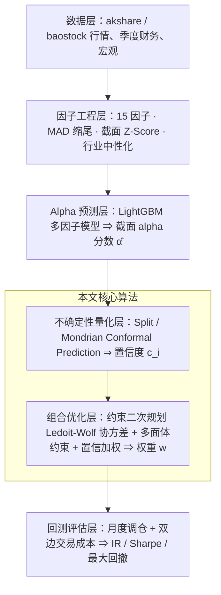
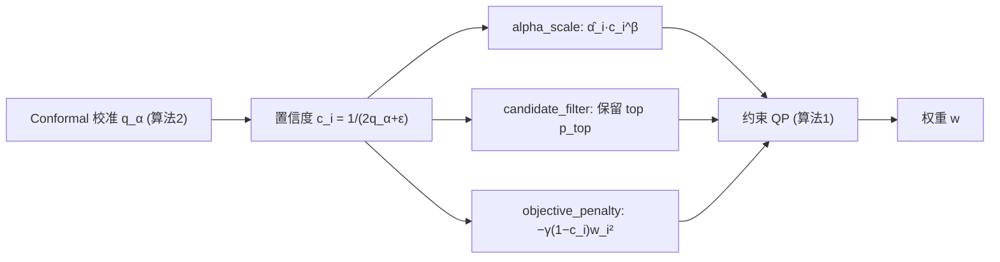
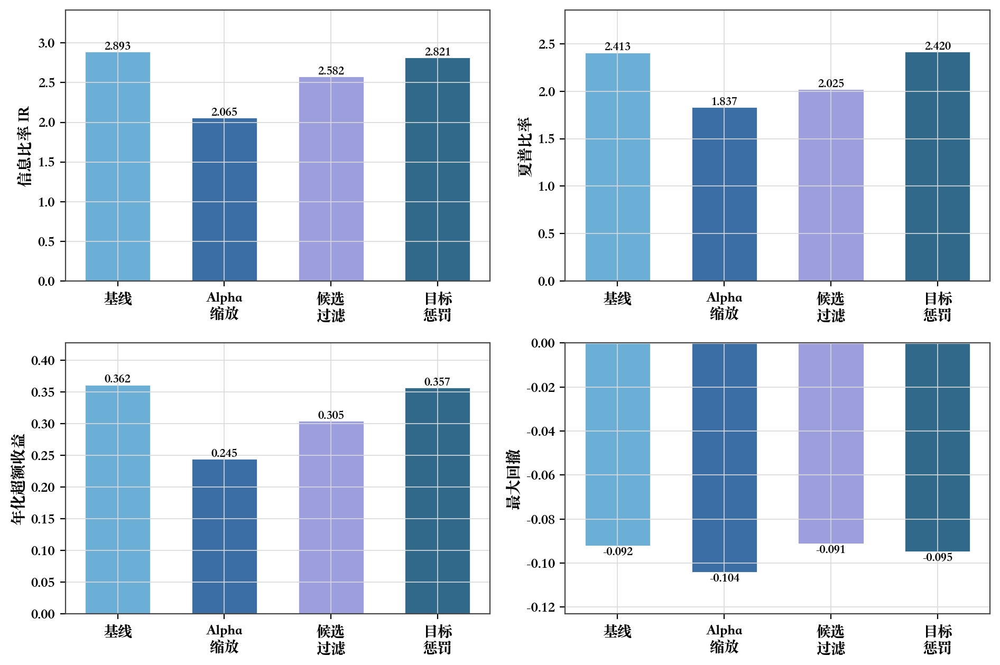
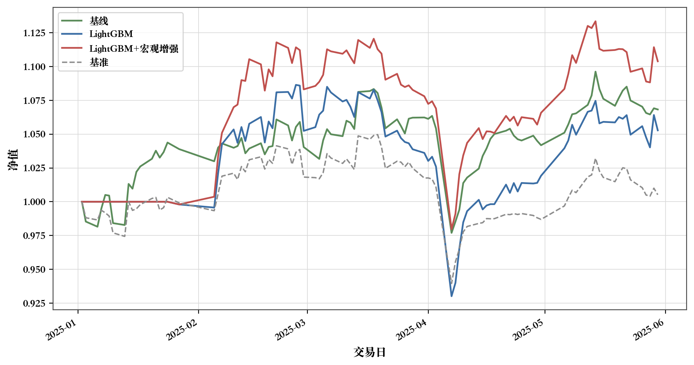

# 面向指数增强策略的量化算法优化设计与实现

> 本文件为论文 `manual.tex` + `abstract.tex` 的 Markdown 预览版（供云端编译前内容审阅）。数学符号、表格、图、伪代码均与 LaTeX 源一致；架构图/流程图以 mermaid 呈现，正式版为 TikZ 矢量图。

---

## 摘要

本文以沪深 300 指数增强为应用场景，对其核心量化算法——带约束的组合优化——展开优化设计与实现。指数增强的本质，是在跟踪误差、行业偏离、个股权重与换手率等多重约束所界定的可行域内，将含噪的截面 alpha 预测高效、稳健地转化为可实施的主动权重，即最大化主动管理基本定律 $IR = TC\cdot IC\cdot\sqrt{N}$ 中的传输系数 $TC$。围绕这一核心算法，本文的工作分为两个层面。其一，面向 A 股市场设计并实现了约束型多因子组合优化算法：以 LightGBM 多因子模型输出截面 alpha 信号，以 Ledoit-Wolf 缩减估计抑制样本协方差病态所致的"误差最大化"，构建带多面体约束的二次规划，并设计 OSQP→CLARABEL→SCS 的求解器回退与最小特征值修正以保证数值稳健性。其二，针对 A 股低信噪比环境下点预测组合优化忽视个股可信度差异这一缺陷，提出不确定性感知的组合优化扩展：以 Split 与 Mondrian Conformal Prediction 为每只股票的 alpha 预测附加具有有限样本覆盖保证的置信度，并设计 alpha 缩放、候选过滤与目标惩罚三种置信加权方案，将可信度耦合进二次规划的目标项与可行域。沪深 300 实证表明，约束型组合优化算法将信息比率由静态多因子的 0.237 提升至 2.449，最大回撤由 −58.53% 收敛至 −25.37%；对不确定性感知扩展的系统评估则揭示，A 股环境下名义 90% 的 Conformal 区间存在约 9 个百分点的系统性低覆盖，且该偏差与显著性水平无关，并伴随"高置信即过拟合"的反向规律；简化的自适应 Conformal 推断模拟可将上述覆盖偏差矫正约 80%，为后续改进指明了方向。

**关键词**：指数增强；组合优化；二次规划；传输系数；Conformal Prediction；不确定性量化

**Abstract.** This thesis studies the optimized design and implementation of the core quantitative algorithm behind index enhancement, namely constrained portfolio optimization, using the CSI 300 index. Index enhancement seeks to transform noisy cross-sectional alpha predictions into implementable active weights within a feasible region delimited by tracking error, industry deviation, single-name weight, and turnover constraints, i.e. to maximize the transfer coefficient $TC$ in $IR = TC\cdot IC\cdot\sqrt{N}$. The work proceeds on two levels: (1) a constrained multi-factor portfolio optimization algorithm with Ledoit-Wolf shrinkage and an OSQP→CLARABEL→SCS solver fallback; (2) an uncertainty-aware extension that couples Split/Mondrian Conformal Prediction confidence into the QP via three weighting schemes. Experiments lift the IR from 0.237 to 2.449 and shrink max drawdown from −58.53% to −25.37%; the evaluation reveals a ~9 pp systematic under-coverage independent of the significance level and an inverse "higher-confidence-implies-overfitting" pattern, of which a simplified ACI corrects ~80%.

**Keywords**: Index Enhancement; Portfolio Optimization; Quadratic Programming; Transfer Coefficient; Conformal Prediction; Uncertainty Quantification

---

# 第一章 绪论

## 1.1 研究背景与问题挑战

随着被动投资的普及与资本市场机构化进程的推进，兼具被动跟踪低成本与主动管理超额收益潜力的指数增强（Index Enhancement）策略日益受到机构与个人投资者的重视。该类策略介于完全被动的指数跟踪与完全主动的证券选择之间，目标是在严格控制相对基准跟踪误差的前提下系统性地获取稳定超额收益，即"Beta 稳健、Alpha 突出"。本文以中国 A 股核心宽基基准——**沪深 300 指数**为实证标的，研究指数增强策略中核心量化算法的优化设计与实现。

从计算视角看，一个完整的指数增强策略可抽象为两个串联环节：其一是**信号生成**（由多源因子预测个股截面超额收益 alpha），其二是**组合构建**（在给定 alpha 预测下求解满足风险与交易约束的可实施权重）。前者是有监督的截面回归问题，后者是带约束的数学规划问题。本文研究的核心是第二个环节——**带约束的组合优化算法**，因为它直接决定预测信号能在多大程度上、以多稳健的方式转化为真实可交易的主动头寸。

组合优化的核心地位可由主动管理基本定律精确刻画。Grinold 将信息比率分解为 $IR = IC\cdot\sqrt{N}$；Clarke 等引入传输系数（Transfer Coefficient，$TC$）将其修正为

$$IR = TC\cdot IC\cdot\sqrt{N},\qquad TC\in[0,1].$$

其中 $TC$ 度量组合优化器将理论 alpha 信号"传输"为实际主动权重的效率。禁止卖空、行业中性、跟踪误差上限与换手率上限等现实约束会系统性压低 $TC$。因此，**在严苛的多面体约束空间内构造一个使 $TC$ 最大化、且数值稳健的优化算法**，构成指数增强策略落地的核心难题。

在 A 股，这一难题面临两重叠加挑战：

- **挑战一：协方差病态与"误差最大化"。** 当资产数（约 300）与估计窗口长度相当时，样本协方差矩阵呈病态。Michaud 指出，直接使用此类矩阵的均值-方差优化器会放大估计误差、在被高估资产上给出极端权重（"误差最大化"）。如何在估计层抑制病态、在求解层保证数值稳健，是优化算法必须解决的工程问题。
- **挑战二：低信噪比下的预测不确定性。** A 股以散户交易为主、错误定价频繁、风格切换剧烈，截面 alpha 预测信噪比极低且高度非平稳。传统优化器只接收 alpha 点预测，默认所有个股同等可信，会把大量权重押注在高方差、低可信度的预测上。如何为 alpha 预测附加有理论保证的不确定性度量并纳入优化，是提升稳健性的关键。

上述两重挑战分别关乎组合优化算法的"求解稳健"与"输入可信"，本文的两项主要工作即与之一一对应、逐一应对。

## 1.2 主要工作与贡献

针对上述两重挑战，本文围绕指数增强的核心组合优化算法展开优化设计与实现。两项主要工作与两重挑战一一对应——前者针对挑战一夯实优化算法的数值稳健性，后者针对挑战二将预测可信度纳入优化：

**（一）面向 A 股的约束型多因子组合优化算法。** 以 LightGBM 多因子模型输出截面 alpha；针对挑战一，采用 Ledoit-Wolf 缩减估计抑制协方差病态，并在求解层附加最小特征值修正保证半正定；构建以 alpha 收益、风险惩罚与换手惩罚为目标、以跟踪误差/行业偏离/单股权重/换手率为约束的二次规划，设计 OSQP→CLARABEL→SCS 三级求解器回退。该算法将信息比率由静态多因子的 0.237 提升至 2.449。

**（二）不确定性感知的组合优化扩展。** 针对挑战二，引入 Split 与 Mondrian Conformal Prediction，为每只股票 alpha 预测构造具有有限样本边际覆盖保证的预测区间，并由区间半宽导出归一化置信度 $c_i$；进而设计 alpha 缩放、候选过滤、目标惩罚三种置信加权方案，将 $c_i$ 耦合进 QP 目标项与可行域。系统评估揭示名义 90% 区间约 9 个百分点的系统性低覆盖（与显著性水平无关）与"高置信即过拟合"反向规律，并以简化 ACI 模拟给出矫正约 80% 覆盖偏差的可行路径。

综上，本文的贡献在于：把指数增强的核心组合优化算法做"深"——在数值稳健的约束优化基础上，进一步将具有理论保证的预测不确定性纳入优化，并以严谨的实证刻画其在 A 股低信噪比环境下的有效性边界与改进方向。本文使用的主要数学符号汇总如下。

**主要数学符号**

| 符号                              | 含义                                              |
| --------------------------------- | ------------------------------------------------- |
| $IR, IC, N, TC$                   | 信息比率、因子信息系数、投资广度、传输系数        |
| $w\in\mathbb{R}^n$                | 组合权重向量；$w_b$ 基准权重，$w_{prev}$ 上期权重 |
| $\hat\alpha\in\mathbb{R}^n$       | 标准化后的截面 alpha 预测分数向量                 |
| $\Sigma\in\mathbb{R}^{n\times n}$ | 个股日收益协方差矩阵（Ledoit-Wolf 缩减估计）      |
| $\lambda, \kappa$                 | 风险厌恶系数、换手惩罚系数                        |
| $\sigma_{TE}$                     | 年化跟踪误差上限                                  |
| $\alpha_{CP}, q_\alpha$           | Conformal 显著性水平、校准残差分位数（区间半宽）  |
| $c_i$                             | 第 $i$ 只股票的归一化 Conformal 置信度            |
| $\beta, p_{top}, \gamma$          | 三种置信加权方案的参数                            |
| $\rho$                            | 校准集占训练样本的比例                            |
| $n_d, n_s$                        | 回测面板的交易日数与股票数                        |

## 1.3 论文组织结构

本文共分五章，各章内容安排如下。

第一章为绪论，交代指数增强的研究背景，论证组合优化在策略中的核心地位，明确以"最大化传输系数"为核心的研究问题及其在 A 股面临的两重挑战，并概述本文的主要工作与贡献。

第二章为背景知识与相关工作，沿两条线索展开：其一是指数增强与组合优化的理论基础，包括主动管理基本定律与传输系数、多因子与机器学习预测、组合优化方法谱系与约束体系、以及协方差估计与误差最大化；其二是不确定性量化与 Conformal Prediction 的框架、覆盖保证、条件覆盖变体及其在金融时序中的偏差与自适应改进。

第三章为本文核心，先给出系统整体框架与架构图，明确核心算法在系统中的位置；继而详述约束型多因子组合优化算法的形式化、协方差处理与求解机制，并以伪代码和复杂度分析严格表达；最后给出其不确定性感知扩展，包括基于 Conformal Prediction 的置信度构造与三种置信加权方案。

第四章为实验与分析，先交代实验环境、数据集与评价指标，再在长周期（2015–2024）与短周期（2024–2025）两条样本上，通过与基线及消融的对比，论证约束优化算法的增益与不确定性感知扩展的行为，并辅以传输系数、严格样本外与随机种子等稳健性检验。

第五章为总结与展望，归纳本文的主要工作与结论，并讨论当前工作的局限与未来的改进方向。

---

# 第二章 背景知识与相关工作

本章系统梳理本文核心算法所依托的理论与相关工作。第 2.1 节围绕指数增强的组合优化展开，自上而下讨论主动管理基本定律所揭示的优化目标、上游多因子信号的生成、组合优化方法的谱系与约束体系、以及作为优化输入的协方差估计与"误差最大化"问题；第 2.2 节围绕本文用以刻画预测可信度的工具，介绍 Conformal Prediction 的框架与覆盖保证、其条件覆盖变体、以及在金融时序中的覆盖偏差与自适应改进。两节分别对应绪论中提出的两重挑战。

## 2.1 指数增强与组合优化的理论基础

### 2.1.1 主动管理基本定律与传输系数

主动管理的数学基础由 Grinold 提出的基本定律（Fundamental Law of Active Management）奠定。其将信息比率分解为单次预测能力与独立投注次数的乘积

$$IR = IC\cdot\sqrt{BR},$$

其中信息系数 $IC$ 度量预测值与实际收益的截面相关性，投资广度 $BR$ 为每年相互独立的投注次数。该定律的直观含义是：主动管理者既可通过提高单次预测的准确度（深度）、也可通过增加相互独立的投注次数（广度）来提升风险调整后收益。然而原始定律隐含两条强假设——各次投注相互独立、且预测能力恒定，二者在现实中均难成立。Ding 与 Martin 指出，当资产残差存在相关、且截面 $IC$ 随时间波动时，有效广度远小于名义资产数，盲目套用原始定律会系统性高估实盘 $IR$。

更关键的是，原始定律默认 alpha 信号可被无摩擦地转化为主动头寸，而真实组合受禁止卖空、跟踪误差、行业与换手等约束限制。为刻画这一缺口，Clarke 等引入传输系数（Transfer Coefficient，$TC$），将基本定律推广为

$$IR = TC\cdot IC\cdot\sqrt{BR},\qquad TC\in[0,1].$$

$TC$ 定义为经风险调整后的主动权重与 alpha 预测之间的截面相关系数，度量了优化器把"纸面信号"传输为"实际头寸"的效率。实证研究表明，仅禁止卖空一项即可使 $TC$ 由理想的 $1$ 降至约 $0.5\!\sim\!0.6$，叠加行业中性与换手限制后更低。Grinold 与 Kahn 的经典教材进一步将该框架系统化为现代主动管理的方法学基础。这一推广具有重要的方法论意义：在信号质量（$IC$）与广度（$BR$）给定的前提下，**指数增强策略的绩效高度依赖于组合优化器对 $TC$ 的最大化能力**，从而把策略落地的核心问题从"预测"转移到了"约束下的最优传输"，这正是本文聚焦组合优化算法的根本动因。

### 2.1.2 多因子 alpha 信号与机器学习预测

组合优化的输入是截面 alpha 预测，其质量决定了基本定律中的 $IC$。多因子模型是生成该信号的主流范式。Fama 与 French 的三因子与五因子模型在成熟市场具有较强解释力，但在 A 股，受宏观调控、信贷干预与散户主导的微观结构影响，投资（CMA）等因子常常冗余，而规模、反转与流动性溢价更为显著，直接移植西方因子结构往往失效。因此面向 A 股的因子体系通常需要在价值、质量、动量与微观结构因子之外，引入宏观状态变量以捕捉系统性风险偏好的切换。

在因子的组合方式上，传统做法是线性打分或线性回归，但其难以刻画因子间的非线性交互与条件触发。Gu、Kelly 与 Xiu 的开创性工作对机器学习在实证资产定价中的应用确立了基准，证明梯度提升树与神经网络等非线性模型在样本外预测精度上全面超越线性回归，其优势主要来自对因子高阶交互的捕获。Chen 等进一步证实，结合宏观状态变量与非线性模型可显著改善 A 股截面预测。在树模型中，LightGBM 借助基于梯度的单边采样（GOSS）与互斥特征捆绑（EFB）大幅降低了训练开销，Yang 验证了其在低信噪比 A 股环境下兼具精度与效率的工程优势。基于上述结论，本文以固定超参数、月度滚动重训的 LightGBM 多因子模型作为组合优化算法的上游 alpha 信号来源；需要强调的是，由于优化层与预测层解耦，该信号源可被替换为任意截面回归模型而不影响本文算法的适用性。

### 2.1.3 组合优化方法谱系与约束体系

给定 alpha 信号后，组合构建方法可大致归为四类。其一是**被动加权法**，如等权与市值加权，不使用预测信息，仅作为基准或对照；其二是**风险导向法**，如风险平价，仅依据协方差分配风险预算而忽略 alpha；其三是**均值-方差优化**，由 Markowitz 奠基，在收益与方差之间权衡，是现代组合理论的核心；其四是在均值-方差框架上施加现实约束的**带约束二次规划**，它是指数增强策略的主流形式。指数增强与一般主动管理的根本区别在于其以\emph{相对基准}的主动收益与主动风险为优化对象，因而其目标函数与约束均围绕主动权重 $w-w_b$ 构造。

约束体系是指数增强组合优化的灵魂，每一项约束都对应明确的金融含义，同时以可控的 $TC$ 损失换取可实施性：跟踪误差上限限制组合相对基准的偏离幅度，是"增强"区别于"主动选股"的定义性特征；行业中性约束避免非预期的行业暴露，使超额收益尽量来自个股 alpha 而非行业择时；单股权重上限保证分散度并满足流动性与监管要求；换手率上限控制交易成本、避免高频再平衡侵蚀收益；而禁止卖空则反映了 A 股融券机制受限的现实约束。这些约束共同将可行域收缩为一个多面体与椭球的交集，优化器须在其中寻找使 $TC$ 最大化的解。第 2.1.1 节的传输系数理论预示了一个关键权衡：约束越严格，可实施性越强，但传输效率 $TC$ 越低；如何在二者间取得最优折衷，是约束型组合优化算法设计的中心问题，本文将在第四章通过约束消融实验对此做定量考察。

### 2.1.4 协方差估计与误差最大化

均值-方差与带约束二次规划均依赖个股收益协方差矩阵 $\Sigma$ 的估计，而 $\Sigma$ 的质量直接决定优化解的稳定性。当资产数 $n$ 与估计窗口长度 $T$ 相当（如 $n\approx 300$、$T\approx 60$）时，样本协方差矩阵呈病态：其条件数极大，最小特征值接近零甚至因数值原因为负。Michaud 将基于此类矩阵的优化称为"误差最大化"（Error Maximization）——优化器把估计噪声当作真实信号，倾向于在被高估收益、被低估风险的资产上给出极端权重，导致解对输入的微小扰动高度敏感、样本外表现急剧恶化。

针对这一问题，协方差估计发展出若干谱系：**样本协方差**简单但病态；**因子模型协方差**（如基于 Fama-French 或统计因子）通过低秩结构降维，但依赖因子设定的正确性；**随机矩阵理论去噪**对样本协方差的特征值谱做修正；**线性收缩估计**则在样本协方差 $S$ 与一个结构化目标矩阵 $F$（如缩放单位阵或常相关模型）之间做凸组合

$$\hat\Sigma = \delta F + (1-\delta)\,S,$$

并以最小化期望 Frobenius 损失 $\mathbb{E}\lVert\hat\Sigma-\Sigma\rVert_F^2$ 的最优强度 $\delta^\*$ 自适应确定收缩程度。Ledoit 与 Wolf 给出了 $\delta^\*$ 的可由数据一致估计的闭式表达。从优化的视角看，收缩压缩了特征值谱的离散度、抬升了最小特征值，从而显著改善矩阵的条件数与正定性，缓解了误差最大化。本文在估计层采用 Ledoit-Wolf 缩减，并在求解层进一步施加最小特征值修正（对负或过小特征值加 ridge 项）以严格保证求解器所需的半正定性，二者共同应对绪论中提出的挑战一。

## 2.2 不确定性量化与 Conformal Prediction

### 2.2.1 Conformal Prediction 框架与覆盖保证

传统组合优化只接收 alpha 的点预测，无法表达不同个股预测可信度的差异。为在弱假设下量化预测不确定性，本文采用 Vovk 等提出的 Conformal Prediction（CP）。CP 的核心是为每个候选标签定义一个不符合度得分（nonconformity score），并据校准数据将测试样本的预测扩展为一个集合或区间。其最重要的性质是：在仅假设数据\emph{可交换性}（exchangeability，弱于独立同分布）的条件下，CP 区间即具有\emph{有限样本边际覆盖保证}。

实践中以分裂式 Conformal（Split / Inductive CP）最为高效：将训练数据划分为建模子集与校准子集，模型在建模子集上拟合后，在容量为 $n$ 的校准子集上计算保形得分 $s_i = |y_i - \hat y_i|$；取其经 Vovk 修正的分位数 $q_\alpha$（分位水平 $\lceil (n+1)(1-\alpha)\rceil / n$），则测试样本的预测区间为 $[\hat y - q_\alpha,\ \hat y + q_\alpha]$。可证明在可交换性下其满足

$$1-\alpha \;\le\; \mathbb{P}\big(Y\in C(X)\big) \;\le\; 1-\alpha + \tfrac{1}{n+1}.$$

该保证不依赖底层模型的正确性与数据分布的具体形式，且仅需一次模型拟合，计算开销极低。Angelopoulos 与 Bates 系统梳理了 CP 在分类与回归任务上的实践范式。本文正是利用 Split CP 的区间半宽来导出个股置信度，作为组合优化的不确定性输入。

### 2.2.2 条件覆盖与代表性变体

Split CP 提供的是\emph{边际}覆盖——在全体样本上平均满足名义水平，却不保证在每个子总体上均成立。然而组合优化更关心\emph{条件}覆盖：高难度个股或特定行业的预测区间是否同样可靠。为改善条件覆盖，文献发展了若干变体。Romano 等的 Conformalized Quantile Regression（CQR）以分位数回归输出自适应宽度的区间，在异方差与重尾场景下显著优于等宽的经典 Split CP。局部自适应（Locally Adaptive）CP 则以一个残差幅度模型对不符合度得分做归一化，使区间宽度随样本难度变化。Mondrian CP 按离散组别（如行业）将校准集分桶、各组独立计算分位数，从而获得组条件覆盖，可缓解组间预测难度不均带来的偏差。

这些变体在覆盖的条件性与区间的自适应性上各有侧重，但其共同前提仍是可交换性。本文同时实现了等宽的 Split CP 与按申万一级行业分组的 Mondrian CP：前者实现简单、便于作为基线；后者引入行业条件性，用以检验"按行业分组校准能否矫正 A 股环境下的覆盖偏差"这一问题（详见第四章）。

### 2.2.3 金融时序中的覆盖偏差与自适应 Conformal

CP 的覆盖保证以可交换性为前提，而金融时序数据天然违背这一假设：收益序列存在时间依赖与波动率聚集，截面之间存在强相关，且市场风格随宏观环境发生分布漂移（distribution shift）。这些因素会使 CP 的实测覆盖系统性偏离名义水平，A 股的低信噪比与强非平稳性更会放大该偏差。Kato 将 CP 直接嵌入组合选择，提出 Conformal Predictive Portfolio Selection 范式，与本文将置信度耦合进组合优化的思路高度相关，但其同样面临可交换性破坏的挑战。

为应对分布漂移，一类自适应/在线 CP 方法应运而生。Gibbs 与 Candès 的 Adaptive Conformal Inference（ACI）通过在线更新名义显著性水平 $\alpha_{t+1}=\alpha_t+\eta\,(\mathbb{1}[y_t\notin C_t]-\alpha)$，使长期平均覆盖收敛到目标，且不依赖分布平稳性。在此基础上，Xu 与 Xie 的 SPCI 引入残差自相关建模以改善时序覆盖；Hallberg 将 ACI 扩展到多步预测；Aydin 等的 Temporal Conformal Prediction 在分位回归之上叠加衰减学习率，专为金融时序非平稳性设计；Yang 等的 Error-quantified Conformal Inference 以平滑反馈替代二值 miscoverage 以加速适配；Sun 等的变点感知 CP 引入显式的状态切换预测；Neglia 等的 ResCP 借助蓄水池计算实现免训练的在线 CP。这些方法在覆盖自适应性上明显优于静态 Split CP，构成本文不确定性感知设计的直接对照与未来改进方向；本文将在第四章以简化的 ACI 模拟，定量验证该路径在 A 股环境下矫正覆盖偏差的潜力。

## 2.3 本章小结

本章系统梳理了本文核心算法所依托的两类理论与相关工作。其一是指数增强与组合优化的理论基础：主动管理基本定律及其传输系数推广 $IR=TC\cdot IC\cdot\sqrt{BR}$ 确立了组合优化（最大化 $TC$）在策略中的核心地位；多因子与机器学习方法为上游 alpha 信号的生成提供了手段；组合优化方法谱系与约束体系刻画了可实施性与传输效率之间的权衡；协方差估计的收缩与修正则为应对"误差最大化"提供了工具，共同对应绪论的挑战一。其二是不确定性量化：Conformal Prediction 在弱假设下为点预测附加了具有有限样本覆盖保证的置信度，其条件覆盖变体与自适应改进为低信噪比、非平稳的金融场景提供了方法储备，对应绪论的挑战二。这些工作共同构成第三章算法设计的出发点。

---

# 第三章 指数增强组合优化算法的设计与实现

## 3.1 系统整体框架

系统由六层串联：数据层（akshare/baostock）→ 因子工程层（15 因子 + 异常值控制 + 截面标准化）→ alpha 预测层（LightGBM → 截面 alpha 分数 $\hat\alpha$）→ 不确定性量化层（Conformal → 置信度 $c_i$）→ 组合优化层（约束 QP → 主动权重 $w$）→ 回测评估层（月度调仓 + 双边交易成本 → IR/Sharpe/回撤）。本文核心算法位于"不确定性量化层 + 组合优化层"。



alpha 预测层与组合优化层**解耦**：优化算法只接收标准化 alpha 分数与（可选）置信度，不依赖具体预测模型，便于消融与复用。上游使用 15 个数值因子，分四组：价值（`ep_ttm`、`bp`）、质量（`roe`、`grossprofitmargin`、`netprofitmargin`、`yoynetprofit`、`assetturnover`、`cfotoor`）、技术与微观结构（`ret_20`、`ret_60`、`volatility_20`、`turnover_20`）、外部宏观（`northbound_net_inflow`、`m2_yoy`、`cn_spread_10y_2y`）；每个因子按日截面依次经 MAD 缩尾（$k=3$）、Z-Score 标准化、行业中性化；标签为相对沪深 300 的 20 日超额收益；alpha 模型为固定超参数 LightGBM，月度滚动重训。

## 3.2 约束型多因子组合优化算法

**优化问题形式化。** 设截面含 $n$ 只股票，$\hat\alpha$ 为标准化 alpha，$w$ 为待求权重，$w_b$ 基准权重，$w_{prev}$ 上期权重，$\Sigma$ 协方差矩阵，主动权重为 $w-w_b$：

$$\max_{w}\ \hat\alpha^\top w - \lambda(w-w_b)^\top\Sigma(w-w_b) - \kappa\lVert w-w_{prev}\rVert_1$$

$$\text{s.t.}\quad \mathbf{1}^\top w=1,\quad 0\le w_i\le w_{\max},$$
$$(w-w_b)^\top\Sigma(w-w_b)\le(\sigma_{TE}/\sqrt{252})^2,$$
$$|\mathbf{1}_{S_k}^\top(w-w_b)|\le d_{ind},\ \forall k,\qquad \lVert w-w_{prev}\rVert_1\le 2\tau_{\max}.$$

目标含 alpha 收益项、$\lambda$ 加权的主动风险惩罚、$\kappa$ 加权的 $\ell_1$ 换手惩罚；约束含全额投资+禁止卖空+单股上限、事前年化跟踪误差上限、行业主动暴露上限、月度单边换手上限。这是带二次约束的凸 QP，$\Sigma$ 半正定时全局最优唯一。约束正是压低 $TC$ 却保证可实施性的现实摩擦。

**协方差估计与数值稳健性。** 取调仓日前 60 个交易日个股日收益，Ledoit-Wolf 缩减得 $\hat\Sigma_{LW}$；对称化并计算最小特征值 $\mu_{\min}$：若 $\mu_{\min}<0$ 加 $(-\mu_{\min}+\epsilon)I$，否则加 $\epsilon I$（$\epsilon=10^{-4}$）。求解层设计 OSQP→CLARABEL→SCS 三级回退，三者均失败则回退到上期/基准权重，结果经裁剪与归一化严格满足箱式约束。

**算法 1：约束型多因子组合优化（单期调仓）**

```
输入: 截面快照(含 α̂、w_b、行业标签)、历史日收益 R、上期权重 w_prev、配置(λ,κ,σ_TE,d_ind,w_max,τ_max)
输出: 主动权重 w 与诊断量(事前跟踪误差、换手、最大行业偏离)
 1: 清洗截面，删除缺失 α̂ 的样本；归一化 w_b 使 1ᵀw_b = 1
 2: 对 α̂ 做截面去均值除标准差，得标准化分数
 3: Σ_LW ← LedoitWolf(R 的近 60 日截面)              # 协方差缩减
 4: 对称化 Σ_LW；计算 μ_min；按符号施加特征值修正或 ridge 项，得 Σ
 5: 构造行业指示矩阵 {1_{S_k}} 与基准行业暴露
 6: 按目标与约束组装 QP
 7: for solver in {OSQP, CLARABEL, SCS}:
 8:     以 solver 求解 QP
 9:     if 状态为最优且解非空:
10:         裁剪到 [0, w_max] 并归一化；return w 与诊断量
11: return 回退权重 w_prev(或 w_b)
```

**复杂度。** 设单期 $n$ 股、协方差窗口 $T=60$：协方差缩减 $O(n^2T)$，最小特征值 $O(n^3)$，QP 单次迭代主导 $O(n^3)$。单期 $O(n^3+n^2T)$，空间 $O(n^2)$；含 $R$ 次调仓的回测总计 $O(R(n^3+n^2T))$。$n\approx300$、$R\approx120$ 时单机 CPU 分钟级完成，无需 GPU。

## 3.3 不确定性感知的组合优化扩展

**置信度构造。** 每个滚动窗口按 $1-\rho:\rho$（$\rho=0.3$）随机划分建模子集 $D_{tr}$ 与校准子集 $D_{cal}$；底层模型在 $D_{tr}$ 拟合后在 $D_{cal}$ 计算保形得分 $s_i=|y_i-\hat y_i|$，取 Vovk 修正分位数

$$q_\alpha=\text{Quantile}_{\lceil(n_{cal}+1)(1-\alpha_{CP})\rceil/n_{cal}}(\{s_i\}),\quad \alpha_{CP}=0.1.$$

测试区间 $[\hat y-q_\alpha,\ \hat y+q_\alpha]$；原始置信度 $\tilde c_i=1/(2q_{\alpha,i}+\epsilon)$，min-max 归一化得 $c_i\in[0,1]$。Mondrian 变体按申万一级行业分组独立计算 $q_\alpha$（组样本不足回退全局）。

**算法 2：Split Conformal 校准与置信度构造**

```
输入: 训练特征 X、标签 y、模型工厂、校准比例 ρ、显著性水平 α_CP
输出: 各测试样本的置信度 {c_i}
 1: 将 (X,y) 随机划分为 D_tr 与 D_cal (比例 1-ρ : ρ)
 2: 在 D_tr 上拟合底层模型，得 f̂
 3: 在 D_cal 上计算保形得分 s_i = |y_i − f̂(x_i)|
 4: q_α ← {s_i} 的 Vovk 修正 (1−α_CP) 分位数
 5: 对测试样本，半宽 ← q_α (Mondrian 取所在行业的 q_α)
 6: c̃_i ← 1/(2·半宽_i + ε)；min-max 归一化得 c_i
 7: return {c_i}
```

**三种置信加权方案**（将 $c_i$ 耦合进算法 1）：

- **alpha 缩放**（`alpha_scale`）：$\hat\alpha_i'=\hat\alpha_i\cdot c_i^\beta$（$\beta=1$），放大高置信样本收益贡献——最激进；
- **候选过滤**（`candidate_filter`）：仅保留置信度前 $p_{top}=70\%$（至少 30 只）进入 QP，其余置零——从可行域剔除低可信样本；
- **目标惩罚**（`objective_penalty`）：目标追加 $-\gamma\sum_i(1-c_i)w_i^2$（$\gamma=0.1$），二次抑制低置信权重——最温和。



**算法 3：不确定性感知组合优化（单期调仓）**

```
输入: 截面快照(含 α̂、w_b、置信度 c)、历史日收益 R、w_prev、方案∈{alpha_scale,candidate_filter,objective_penalty} 及参数(β,p_top,γ)
输出: 主动权重 w
 1: if 截面无置信度列: return 算法1 的结果          # 向后兼容
 2: 将 c 截断到 [0,1]，缺失以中位数填充
 3: if 方案 = candidate_filter:
 4:     按 c 降序保留前 ⌈p_top·n⌉ 只(至少 30 只)
 5: 执行算法1 步骤 1–5 (清洗、标准化、协方差、行业矩阵)
 6: if 方案 = alpha_scale:  α̂ ← α̂ ⊙ c^β              # 逐元素缩放
 7: if 方案 = objective_penalty: 目标追加 −γΣ(1−c_i)w_i²
 8: 经三级求解器回退求解 QP；裁剪并归一化
 9: return w
```

至此完成核心组合优化算法的设计与实现：算法 1 以协方差缩减、特征值修正与求解器回退应对挑战一；算法 2–3 以 Conformal 置信度的三种耦合应对挑战二。

---

# 第四章 实验与分析

## 4.1 实验环境与实验设置

### 4.1.1 实验环境与数据集

本文全部实验在一台搭载 Apple Silicon M 系列芯片的个人计算机上完成，运行环境为 Python 3.11。组合优化的二次规划由 cvxpy 建模并调用 OSQP、CLARABEL 与 SCS 三个开源求解器；上游 alpha 模型采用 LightGBM；协方差的 Ledoit-Wolf 缩减估计与 Conformal Prediction 的校准均基于 scikit-learn 实现。整条实验链路不依赖 GPU，可在普通 CPU 环境下完整复现，这对资源受限的研究场景具有现实意义。

为兼顾"长周期稳健性"与"端到端流程验证"两方面需求，本文构造了两条互补的实验样本。**长周期样本**覆盖 2015 年 1 月至 2024 年 12 月共十年，约 618{,}056 行因子面板（298/300 股覆盖），用于在完整的牛熊周期中检验约束组合优化算法的稳健增益。**短周期样本**覆盖 2024 年 1 月至 2025 年 5 月共 17 个月（299/300 股 × 339 交易日，约 100{,}993 行），区间较短但因子齐全，用于评估不确定性感知扩展的端到端行为。两条样本均采用月度调仓，并计入 0.1% 的双边手续费与 0.1% 的双边滑点，以贴近真实交易成本。经统计，面板的数据完整性良好：多数因子的非空率超过 94%，基准权重的日截面之和稳定在 0.998，每日有效股票覆盖均值为 297.9 只，满足后续机器学习与组合优化实验的输入要求。

### 4.1.2 评价指标与实验设计

本文统一采用指数增强领域的标准绩效指标，包括年化超额收益、夏普比率、最大回撤与年化换手率等，其中信息比率（IR）为衡量主动管理能力的核心指标。围绕第三章提出的两个算法层面，实验设计为三组递进的对比：第一组在长周期样本上验证约束组合优化算法（算法 1）相对静态多因子基线的增益，并通过约束消融剖析各约束项的作用；第二组在短周期样本上评估不确定性感知扩展（算法 2、3），重点考察三种置信加权方案的绩效、Conformal 区间的覆盖行为及其内在机理；第三组通过综合策略横向对比、传输系数估计与严格样本外检验，论证算法的可实施性与稳健性。各模块的关键超参数取默认值（见表 4-1）。

| 模块       | 超参数                                   | 默认值                   |
| ---------- | ---------------------------------------- | ------------------------ |
| 约束优化器 | 跟踪误差上限 $\sigma_{TE}$               | 0.08（年化）             |
|            | 行业偏离 $d_{ind}$ / 单股上限 $w_{\max}$ | 0.02 / 0.05              |
|            | 月度单边换手 $\tau_{\max}$               | 0.20                     |
|            | 风险厌恶 $\lambda$ / 换手惩罚 $\kappa$   | 5.0 / 0.002              |
| 协方差     | 估计窗口 / ridge $\epsilon$              | 60 日 / $10^{-4}$        |
|            | 估计方法                                 | Ledoit-Wolf 缩减         |
| Conformal  | 显著性 $\alpha_{CP}$ / 校准比例 $\rho$   | 0.10 / 0.30              |
|            | 加权参数 $\beta/p_{top}/\gamma$          | 1.0 / 0.70 / 0.10        |
| LightGBM   | n_estimators / learning_rate             | 300 / 0.05               |
|            | num_leaves / 滚动窗口                    | 31 / 12（长）, 6（短）月 |

## 4.2 实验结果与分析

### 4.2.1 约束组合优化算法的增益分析

为验证约束组合优化算法能否将含噪的 alpha 信号高效转化为可实施的超额收益，本文在长周期样本上对比了三种递进配置：仅以静态多因子打分驱动优化器的基线、以 LightGBM 输出的 alpha 驱动优化器的版本、以及进一步叠加外部宏观因子与行业中性化的增强版本，绩效结果如表 4-2 所示。

| 评价指标     | 静态多因子基线 | LightGBM 驱动 | +宏观与中性化 |
| ------------ | -------------- | ------------- | ------------- |
| 年化超额收益 | 4.21%          | 28.07%        | **41.31%**    |
| 夏普比率     | 0.168          | 1.289         | **1.881**     |
| 信息比率 IR  | 0.237          | 1.685         | **2.449**     |
| 最大回撤     | −58.53%        | −31.71%       | **−25.37%**   |
| 年化换手率   | 0.125          | 2.083         | 2.242         |

数据呈现出清晰的逐级增益：信息比率由静态多因子的 0.237 依次提升至 1.685 与 2.449，对应年化超额收益由 4.21% 跃升至 28.07% 与 41.31%；与此同时，最大回撤由 −58.53% 单调收敛至 −31.71% 与 −25.37%，而年化换手率始终被控制在 2.24 以内的可实施区间。这一组对比说明，优化算法的价值并不在于单纯放大收益，而在于同时改善收益、风险与可交易性三者的折衷——增强版本在年化超额提升近十倍的同时，最大回撤反而减半，这正是约束体系与协方差缩减协同作用的结果。

图 4-1 以净值曲线直观地展示了上述增益。图中蓝、橙、绿三条实线分别对应静态基线、LightGBM 驱动与增强版本，红色虚线为沪深 300 基准；纵轴为组合净值，横轴为交易日期。可以观察到，基线组合在十年间几乎贴合基准、净值长期徘徊于 1 至 2 之间，说明在缺乏有效 alpha 时，优化器至多复制基准而无法创造超额；与之形成鲜明对照，两条机器学习曲线自 2020 年起与基准急剧分化，增强版本净值最终逼近 30，并在 2024 年末的市场反弹中出现一段陡峭跃升。值得注意的是，分化的起点（2020 年前后）恰对应 A 股机构化程度提升、基本面定价增强的阶段，这从侧面印证了模型所依赖的基本面信号在该时期的有效性。回撤曲线（此处从略）亦呈现一致的排序：基线回撤最深、在 2022–2023 年触及约 −58%，基准次之约 −40%，而 LightGBM 与增强版本依次收窄至 −30% 与 −20% 量级，表明跟踪误差与行业约束在放大 alpha 的同时有效抑制了尾部风险。


为进一步理解增益的来源与边界，本文从两个角度做了补充分析。其一，从模型的特征使用看，主导决策的是质量与价值类基本面因子——毛利率、市盈率倒数与市净率倒数的滚动分裂次数最高（分别约 893、874、735 次），而宏观因子（中美利差、M2 同比）的分裂次数虽居中游，却具有最大的跨期方差（标准差分别达 ±112、±105），说明它们更多扮演"条件触发"的角色，在不同市场状态下被差异化地启用，从而赋予模型动态风格轮动的能力。其二，从分市场状态的表现看，机器学习策略在绝大多数牛熊区间均显著优于基线，2019–2021 年的结构性牛市中信息比率高达 6.6 与 9.3；唯一的例外是 2015 年杠杆驱动的全面牛市，此时模型出现明显的负信息比率（约 −4.8），原因在于该轮行情由非基本面的散户杠杆资金主导，与模型所依赖的基本面逻辑相背离。这一现象既肯定了算法在常态市场下的稳健增益，也诚实地界定了其在极端非理性行情下的失效边界。

### 4.2.2 约束条件的有效性消融

约束体系是压低传输系数、却保障可实施性的关键所在。为厘清各约束项的具体作用，本文在 LightGBM 驱动版本的基础上，逐一移除跟踪误差、行业偏离与换手率约束并重新回测，结果如表 4-3 所示。

| 消融方案       | 年化超额 | 夏普  | IR    | 最大回撤 | 年化换手 |
| -------------- | -------- | ----- | ----- | -------- | -------- |
| 完整约束       | 28.07%   | 1.289 | 1.685 | −31.71%  | 2.08     |
| 无跟踪误差约束 | 25.97%   | 1.141 | 1.472 | −33.62%  | 2.08     |
| 无行业偏离约束 | 29.90%   | 1.394 | 1.760 | −32.47%  | 2.08     |
| 无换手率约束   | 39.11%   | 1.791 | 2.334 | −29.83%  | 8.14     |

分析表明，三类约束的作用各不相同。移除跟踪误差约束后，信息比率不升反降（1.685→1.472）、最大回撤亦同步加深，说明在 A 股的高波动环境下，跟踪误差约束实际承担了正向的风险控制功能，而非单纯束缚收益的枷锁。移除行业偏离约束仅带来微弱的信息比率提升（1.685→1.760），代价却是行业暴露失控、风格集中风险上升。最具迷惑性的是移除换手率约束：信息比率飙升至 2.334，但年化换手率随之由 2.08 暴涨至 8.14，已远超指数增强产品的可实施边界，落入了忽视交易成本的"无摩擦乌托邦"。综合来看，完整约束版本是收益与可实施性之间的最优折衷，这与第二章传输系数理论的预期完全一致：合理的约束以可控的传输效率损失，换取了策略在真实市场中的可落地性。

### 4.2.3 不确定性感知扩展的评估

本组实验在短周期样本上评估第三章的不确定性感知扩展，并循着"绩效—覆盖—机理—矫正"的脉络逐层剖析其在 A 股环境下的行为。

**置信加权方案的绩效。** 本文在同一约束型 LightGBM 流程上分别启用 alpha 缩放、候选过滤与目标惩罚三种方案，并以不加权版本为基线，结果如表 4-4 与图 4-2 所示，其中图 4-2 以分组柱状图对比四种配置在信息比率、夏普比率、年化超额与最大回撤上的表现。

| 方案                | 年化超额 | 夏普  | IR        | 最大回撤 | 年化换手 |
| ------------------- | -------- | ----- | --------- | -------- | -------- |
| 基线（不加权）      | 36.19%   | 2.413 | **2.893** | −9.22%   | 2.30     |
| alpha 缩放（β=1）   | 24.47%   | 1.837 | 2.065     | −10.43%  | 2.30     |
| 候选过滤（top 70%） | 30.49%   | 2.025 | 2.582     | −9.13%   | 2.61     |
| 目标惩罚（γ=0.1）   | 35.70%   | 2.420 | 2.821     | −9.50%   | 2.30     |



一个出乎直觉的结果是：三种置信加权方案的信息比率均未能超过不加权基线（2.893）。更具规律性的是，绩效损失与方案的"激进程度"呈单调关系——直接重标定收益的 alpha 缩放损失最大（信息比率降至 2.065），硬性剔除低置信样本的候选过滤居中（2.582），仅做温和二次抑制的目标惩罚最接近基线（2.821）。这一"越激进越受损"的现象提示，Conformal 置信度信号本身可能存在系统性偏差，使得"信任高置信样本"这一直觉性策略适得其反。以下两步分析依次揭示该偏差的存在与成因。

**覆盖偏差的系统性。** 为检验置信度的可靠性，本文首先考察 Conformal 区间的覆盖行为。在 2680 个真实预测点上扫描三档显著性水平，结果如表 4-5 所示。

| 显著性水平 α | 名义覆盖率 | 实测覆盖率 | 覆盖偏差 | 平均区间宽度 |
| ------------ | ---------- | ---------- | -------- | ------------ |
| 0.05         | 95%        | 86.6%      | −8.4 pp  | 0.202        |
| 0.10         | 90%        | 80.9%      | −9.1 pp  | 0.164        |
| 0.20         | 80%        | 70.8%      | −9.2 pp  | 0.128        |

实测覆盖率系统性地低于名义覆盖率，且覆盖偏差稳定保持在 −8.4 至 −9.2 个百分点、几乎不随显著性水平变化。这说明该低覆盖并非区间宽度设定不当的偶发现象，而是可交换性假设在 A 股非平稳、强截面相关环境下被破坏所导致的、方法学层面的系统性偏差；与此相印证，按月份观察时覆盖率多数月份在 0.81 至 0.91 间波动，却在 2024 年 8 月市场剧烈波动时骤降至 0.43，凸显了分布漂移对覆盖的冲击。

**失效机理：高置信即过拟合。** 覆盖整体偏窄尚不足以解释置信加权为何失效。为深入成因，本文按置信度将预测分为高、中、低三桶，统计各桶的信息比率与方向命中率，结果如表 4-6 与图 4-3 所示。

| 分桶                 | 样本数 | IR         | 命中率 |
| -------------------- | ------ | ---------- | ------ |
| 高置信（top 30%）    | 804    | −0.140     | 0.425  |
| 中置信（mid 40%）    | 1072   | −0.028     | 0.419  |
| 低置信（bottom 30%） | 804    | **+0.454** | 0.484  |


图 4-3 揭示出一条鲜明的反向单调规律：高置信桶的信息比率反而为负（−0.140），随置信度下降信息比率不降反升，至低置信桶达到 +0.454；与之呼应，三桶的方向命中率（42.5%/41.9%/48.4%）全部低于 50% 的随机基准，且同样是低置信桶最高。这一"高置信即过拟合"的反向规律，恰好解释了前述置信加权失效的现象：在低信噪比的 A 股市场，Conformal 的"高置信"实际反映的是校准残差分布的同质化（即模型的过拟合程度），而非预测的真实可靠性；因此越是激进地把权重向高置信样本倾斜，越会放大过拟合带来的损失。为排除该规律是 Split CP 等宽区间的特例，本文进一步以按行业分组校准的 Mondrian CP 在真实数据上复测，发现整体覆盖率仅由 80.9% 微升至 81.3%、高置信桶信息比率反而恶化至 −0.205，表明这一反向规律相当稳健，单靠行业分组无法矫正。

**矫正路径：自适应 Conformal。** 上述系统性低覆盖指向了明确的改进方向。本文以 Adaptive Conformal Inference 的在线更新规则在 3276 个日度预测点上做简化模拟，考察学习率 η 对覆盖率的矫正效果，结果如表 4-7 所示。

| 学习率 η                                             | 平均 $\alpha_t$ | 最终 $\alpha_t$ | 估算覆盖率 |
| ---------------------------------------------------- | --------------- | --------------- | ---------- |
| 0.005                                                | 0.103           | 0.104           | **89.7%**  |
| 0.010                                                | 0.105           | 0.108           | **89.5%**  |
| 0.050                                                | 0.126           | 0.139           | 87.4%      |
| 0.100                                                | 0.152           | 0.178           | 84.8%      |
| _对照：静态 Split CP 实测覆盖率 = 80.9%（名义 90%）_ |                 |                 |            |

结果显示，在较低学习率（0.005~0.01）下，估算覆盖率可由静态 Split CP 的 80.9% 回升至 89.5%~89.7%，相当于矫正了约 80% 的覆盖偏差；而学习率过大（0.1）则因名义水平自身震荡反而恶化覆盖。这一结果定性地验证了自适应 Conformal 在 A 股环境下矫正覆盖偏差的可行性，其正式实现与端到端集成留作未来工作。

### 4.2.4 综合策略对比与稳健性检验

最后，本文将代表性策略置于同一短周期面板上横向对比，并通过传输系数、严格样本外与随机种子三项检验论证结论的稳健性。表 4-8 给出等权基线、LightGBM 加约束优化器、以及叠加 Conformal 目标惩罚三种策略的对比。

| 策略                  | 年化超额 | Sharpe | IR        | 最大回撤   | 年化换手 |
| --------------------- | -------- | ------ | --------- | ---------- | -------- |
| 等权基线（无优化器）  | 7.43%    | 0.852  | 0.732     | −12.85%    | 5.13     |
| LightGBM + 约束优化器 | 66.31%   | 3.336  | **5.839** | **−9.22%** | **2.30** |
| + Conformal 目标惩罚  | 65.41%   | 3.342  | 5.634     | −9.50%     | 2.30     |

相对等权基线（信息比率 0.732、换手率 5.13），约束优化器在将信息比率提升至 5.839 的同时，把换手率压低至 2.30、最大回撤收窄至 −9.22%，再次印证了算法在收益与可实施性上的双重价值；Conformal 目标惩罚版本信息比率略低（5.634），与上一小节的结论一致——短样本低信噪比下置信加权尚不能带来正贡献，但其温和形式并未显著损害绩效，为不确定性感知优化保留了可扩展的接口。

**传输系数的定量验证。** 为定量印证第二章的传输系数理论，本文进一步考察不启用优化器时 LightGBM 等权策略在不同持仓数下的信息比率：Top 10/20/30/50 分别为 8.26/7.13/6.37/4.98，随持仓集中度提高而单调上升。以 Top 20 的等权上限 7.13 与加优化器后的 5.839 相比，可估得传输系数约为 $TC\approx 5.839/7.13\approx 0.82$，即优化器在严格风控约束下仍传输了约 82% 的理论 alpha，与 $IR=TC\cdot IC\cdot\sqrt{BR}$ 的框架定量吻合。

**严格样本外检验。** 为检验模型的可投资性，本文冻结训练好的模型、禁止滚动重训，在 2025 年做样本外回测，信息比率结果如表 4-9 所示，近期训练下的净值曲线见图 4-4。

| 训练设定                   | 基线  | Factor-only | +External |
| -------------------------- | ----- | ----------- | --------- |
| 2024 → 2025（近期窗口）    | 1.460 | 2.729       | **2.857** |
| 2015–2024 → 2025（长历史） | 1.460 | −0.482      | −0.283    |



当以近期一年（2024）训练时，机器学习策略仍稳定击败基线（增强版信息比率 2.857 对 1.460），图 4-4 中两条机器学习净值曲线（橙、绿）显著高于基线（蓝）与基准（红虚）；但当训练窗口扩展至 2015–2024 全历史时，模型反而出现负信息比率（−0.283），净值上长历史训练的机器学习曲线被基线反超。这一鲜明对照表明，过时的历史风格在 A 股会退化为噪声，唯有近期短窗口的滚动重训才能保证模型的可投资性，从而为第三章采用月度滚动重训的设计提供了直接的实证支撑。

**随机种子稳定性。** 为排除结论依赖于幸运的随机种子，本文以 5 个不同种子重跑核心策略，信息比率均值为 7.01、标准差仅 0.13、变异系数 1.85%，远低于通常认为可疑的 5%~10% 阈值，说明所报告的绩效是稳健结果而非随机挑选所得。

## 4.3 本章小结

约束组合优化算法长周期上将 IR 由 0.237 提升至 2.449、最大回撤由 −58.53% 收敛至 −25.37%，约束消融、$TC\approx0.82$ 与严格 OOS 多角度证实其稳健性与可实施性。不确定性感知扩展评估表明：A 股低信噪比下 Conformal 置信度存在约 9 个百分点、与显著性水平无关的系统性低覆盖，并伴随"高置信即过拟合"反向规律，致使置信加权暂未正贡献；而简化 ACI 模拟可矫正约 80% 覆盖偏差，指明改进方向。

---

# 第五章 总结与展望

## 5.1 工作总结

本文围绕沪深 300 指数增强的核心量化算法——带约束的组合优化——展开优化设计与实现：

1. 从主动管理基本定律 $IR=TC\cdot IC\cdot\sqrt N$ 出发，明确组合优化（最大化 $TC$）的核心地位，并将其在 A 股的落地难题归结为协方差病态与低信噪比预测不确定性两重挑战。
2. 针对协方差病态，设计并实现约束型多因子组合优化算法（Ledoit-Wolf 缩减 + 最小特征值修正 + 多面体约束 QP + OSQP→CLARABEL→SCS 回退）。长周期上 IR 由 0.237 提升至 2.449，最大回撤由 −58.53% 收敛至 −25.37%，以约 0.82 的传输系数高效兑现理论 alpha。
3. 针对预测不确定性，将 Split/Mondrian CP 引入组合优化，设计三种置信加权方案；系统评估给出完整工程实现，并揭示约 9 个百分点、与显著性水平无关的系统性低覆盖及"高置信即过拟合"反向规律，简化 ACI 模拟表明约 80% 偏差可被在线学习率矫正。

## 5.2 局限与未来展望

- **自适应 CP 的端到端集成**：将 Temporal CP / 变点感知 CP / ResCP 正式实现并端到端接入优化器，在线矫正 −9 个百分点偏差，检验置信加权能否在矫正覆盖后转为正贡献。
- **协方差估计升级**：引入生成式方法（如扩散因子模型）的多场景合成收益估计协方差，更灵活刻画 A 股非线性相关结构。
- **分布鲁棒的组合优化**：探索 DRO，将预测不确定性直接写入约束的"最坏情形"形式，使可行域本身免疫预测误差，与置信加权互补。
- **更长样本与跨市场验证**：在更长样本与中证 500/1000 上复测稳健性，并系统评估交易成本模型对传输系数的影响。
